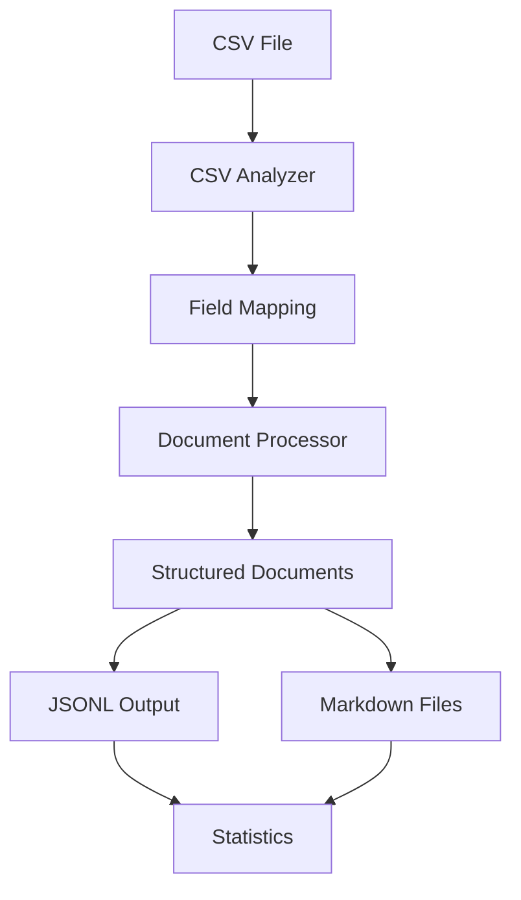

# iLand Data Processing Module

**Converts raw CSV datasets into structured documents ready for embedding and RAG retrieval.**

This module processes Thai land deed CSV files into well-structured documents with rich metadata, organized sections, and multiple output formats (JSONL, Markdown). It's the first step in the iLand RAG pipeline.

## 🎯 Purpose

**Input**: Raw CSV file with Thai land deed records  
**Output**: Structured documents with rich metadata and organized sections  
**Use Case**: Preparing data for embedding and retrieval in RAG applications

## 🚀 Quick Start

### Prerequisites
- CSV file at `data/input_docs/input_dataset_iLand.csv`
- Python dependencies: `pandas`, `pathlib`, `json`, `logging`

### Run Data Processing
```bash
# From project root (RECOMMENDED)
cd llama-index-rag-pipeline
python -m src-iLand.data_processing.main

# From src-iLand directory
cd src-iLand
python -m data_processing.main
```

### Expected Output
```
✅ Configuration generated and saved
📄 Documents processed in batches
💾 JSONL file created: data/output_docs/iland_documents.jsonl
📝 Markdown files: data/output_docs/iland_markdown_files/
📊 Processing statistics displayed
```

## 📁 Module Architecture

### Core Components

| File | Purpose | Lines |
|------|---------|-------|
| `main.py` | Entry point and orchestration | ~67 |
| `iland_converter.py` | Main converter class | ~153 |
| `document_processor.py` | Document text generation and structuring | ~440 |
| `csv_analyzer.py` | CSV analysis and field mapping | ~388 |
| `config_manager.py` | Configuration management | ~99 |
| `file_output.py` | Output file generation (JSONL, Markdown) | ~240 |
| `statistics_generator.py` | Processing statistics | ~121 |
| `models.py` | Data classes and models | ~52 |

### Supporting Components

| File | Purpose | Lines |
|------|---------|-------|
| `section_parser.py` | Section-based chunking for embeddings | ~348 |
| `run_data_processing_standalone.py` | Standalone script execution | ~123 |
| `__init__.py` | Package exports | ~33 |

## 🔧 Core Functionality

### 1. CSV Analysis (`csv_analyzer.py`)
- **Smart encoding detection**: Handles various CSV encodings
- **Field mapping**: Maps CSV columns to Thai land deed fields
- **Data validation**: Identifies required and optional fields
- **Statistical analysis**: Provides data quality insights

### 2. Document Processing (`document_processor.py`)
- **Structured text generation**: Creates well-organized document sections
- **Thai metadata extraction**: Extracts 30+ Thai-specific fields
- **Content organization**: Groups related information logically
- **Quality assurance**: Validates generated documents

### 3. Configuration Management (`config_manager.py`)
- **Auto-configuration**: Generates config from CSV analysis
- **Field mapping**: Manages CSV column to metadata mapping
- **Reusable configs**: Saves configurations for future use

### 4. File Output (`file_output.py`)
- **JSONL format**: Machine-readable format for embeddings
- **Markdown files**: Human-readable individual documents
- **Batch processing**: Handles large datasets efficiently
- **Directory organization**: Creates organized output structure

## 📊 Document Structure

### Generated Document Sections
```markdown
# Thai Land Deed Document

## ข้อมูลโฉนด (Deed Information)
- Deed serial number, type, book/page references

## ที่ตั้ง (Location)
- Province, district, subdistrict, detailed address

## พิกัดภูมิศาสตร์ (Geolocation)
- GPS coordinates, zone information

## รายละเอียดที่ดิน (Land Details)
- Land names, categories, characteristics

## ขนาดพื้นที่ (Area Measurements)
- Area in rai, ngan, wa with metric conversions

## การจำแนกประเภท (Classification)
- Land use categories, ownership types

## วันที่สำคัญ (Important Dates)
- Issue dates, expiry dates, registration dates

## ข้อมูลการเงิน (Financial Information)
- Valuations, taxes, fees

## ข้อมูลเพิ่มเติม (Additional Information)
- Notes, special conditions, references
```

### Metadata Fields (30+)
```python
{
    # Core identification
    "deed_serial_no": "12345/2567",
    "deed_type": "โฉนดที่ดิน",
    "province": "กรุงเทพมหานคร",
    
    # Location hierarchy
    "location_hierarchy": "กรุงเทพฯ > คลองเตย > คลองเตย",
    
    # Area measurements
    "area_rai": 2.5,
    "area_ngan": 3.0,
    "area_wa": 45.0,
    "area_formatted": "2-3-45",
    
    # Enhanced categories
    "area_category": "medium",
    "deed_type_category": "chanote",
    "region_category": "central",
    "land_use_category": "residential",
    
    # Processing metadata
    "processing_timestamp": "2024-01-15T10:30:00",
    "source_file": "input_dataset_iLand.csv",
    "row_number": 1
}
```

## 🔄 Processing Flow



1. **CSV Analysis**: Analyze structure and generate field mappings
2. **Configuration**: Create or load processing configuration
3. **Document Generation**: Process each row into structured document
4. **Output Creation**: Save as JSONL and individual Markdown files
5. **Statistics**: Generate processing and quality statistics

## 🎯 Section-Based Chunking Integration

The `section_parser.py` component provides section-aware chunking for the embedding pipeline:

```python
from data_processing.section_parser import LandDeedSectionParser

parser = LandDeedSectionParser(
    chunk_size=512,
    chunk_overlap=50,
    min_section_size=50
)

# Parse structured document into section-based chunks
chunks = parser.parse_simple_document_to_sections(document)
```

**Benefits**:
- **Semantic coherence**: Chunks follow document structure
- **Better retrieval**: Section-aware chunks improve search quality
- **Metadata preservation**: Maintains section context in embeddings

## 📈 Output Statistics

### Processing Metrics
- Total documents processed
- Processing time and rate
- Memory usage
- Error counts and types

### Data Quality Metrics
- Field completeness rates
- Data validation results
- Content length distributions
- Metadata coverage analysis

### Document Statistics
- Section count per document
- Content length analysis
- Field utilization rates
- Category distributions

## 🛠️ Configuration

### Auto-Generated Configuration
```python
{
    "name": "iland_deed_records",
    "description": "Thai land deed processing configuration",
    "field_mappings": [
        {
            "csv_field": "deed_no",
            "target_field": "deed_serial_no",
            "required": True,
            "data_type": "string"
        }
        # ... more mappings
    ]
}
```

### Custom Configuration
```python
# Load custom configuration
converter = iLandCSVConverter(csv_path, output_dir)
config = converter.load_configuration("custom_config.json")

# Or modify auto-generated config
config = converter.setup_configuration(auto_generate=True)
config.field_mappings.append(custom_mapping)
```

## 🔍 Troubleshooting

### Common Issues

**"CSV file not found"**
- Ensure `input_dataset_iLand.csv` is in `data/input_docs/`
- Check file permissions and path

**"Import errors"**
- Run from correct directory (see Quick Start)
- Verify all module files are present

**"Encoding errors"**
- CSV analyzer handles most encodings automatically
- Check for special characters or corrupted files

**"Memory issues with large datasets"**
- Adjust `batch_size` parameter in configuration
- Process in smaller chunks if needed

### Debug Mode
```python
import logging
logging.basicConfig(level=logging.DEBUG)

# Run with detailed logging
converter = iLandCSVConverter(csv_path, output_dir, debug=True)
```

## 🚨 Important Notes

### Do I Need to Rerun?
**Usually NO** - If you've already processed your CSV data, you don't need to rerun unless:
- You have new CSV data to process
- You need different output formats
- You want to modify field mappings or document structure

### Performance Considerations
- **Large datasets**: Use batch processing (automatically handled)
- **Memory usage**: Monitor for datasets >10GB
- **Processing time**: ~100-500 docs/second depending on complexity

### Data Requirements
- **CSV format**: Standard CSV with headers
- **Encoding**: UTF-8 recommended (auto-detected)
- **Required fields**: At least deed number or identifier
- **Optional fields**: All other Thai land deed fields
