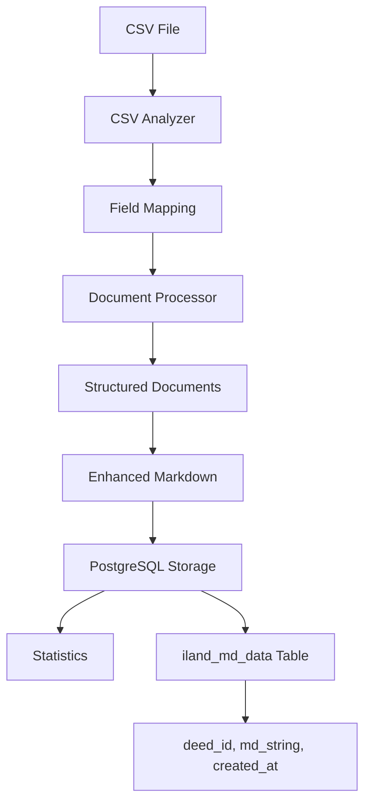

# iLand Data Processing PostgreSQL Module

**Converts raw CSV datasets into structured documents and stores them directly in PostgreSQL for embedding and RAG retrieval.**

This module processes Thai land deed CSV files into well-structured documents with rich metadata, organized sections, and stores them in PostgreSQL database. It's the first step in the iLand PostgreSQL RAG pipeline, replacing local file storage with database storage.

## 🎯 Purpose

**Input**: Raw CSV file with Thai land deed records  
**Output**: Structured documents stored in PostgreSQL with rich metadata  
**Use Case**: Preparing data for PostgreSQL-based embedding and retrieval in RAG applications

## 🚀 Quick Start

### Prerequisites
- PostgreSQL database with PGVector extension
- CSV file at `data/input_docs/input_dataset_iLand.csv`
- Python dependencies: `pandas`, `psycopg2-binary`, `python-dotenv`, `pathlib`, `json`, `logging`

### Environment Setup
```bash
# Create .env file with your PostgreSQL configuration
cat > .env << EOF
# PostgreSQL Database Configuration
DB_NAME=iland-vector-dev
DB_USER=vector_user_dev
DB_PASSWORD=your_password_here
DB_HOST=your_host_here
DB_PORT=5432

# Source table for processed documents
SOURCE_TABLE=iland_md_data

# Optional: CSV file path (if not in default location)
CSV_FILE_PATH=data/input_docs/input_dataset_iLand.csv
EOF
```

### Run PostgreSQL Data Processing
```bash
# From project root (RECOMMENDED)
cd llama-index-rag-pipeline
python -m src-iLand.data_processing_postgres.run_data_processing_standalone

# Alternative: Direct execution
cd src-iLand/data_processing_postgres
python run_data_processing_standalone.py

# For testing specific number of rows
python run_data_processing_standalone.py --limit 100
```

### Expected Output
```
✅ Database connection established
📊 CSV analysis completed: 1000 rows detected
🔄 Processing documents in batches...
💾 Inserted 1000 documents into iland_md_data table
📈 Processing statistics saved
✅ PostgreSQL data processing completed
```

## 📁 Module Architecture

### Core Components

| File | Purpose | Lines |
|------|---------|-------|
| `main.py` | Entry point and orchestration | ~104 |
| `run_data_processing_standalone.py` | Standalone script with CLI | ~123 |
| `db_manager.py` | PostgreSQL database operations | ~203 |
| `iland_converter.py` | Main converter class | ~244 |
| `document_processor.py` | Document text generation and structuring | ~440 |
| `csv_analyzer.py` | CSV analysis and field mapping | ~409 |
| `config_manager.py` | Configuration management | ~99 |
| `file_output.py` | Enhanced markdown generation | ~249 |
| `statistics_generator.py` | Processing statistics | ~121 |
| `models.py` | Data classes and models | ~52 |

### PostgreSQL Components

| File | Purpose | Lines |
|------|---------|-------|
| `db_manager.py` | Database connection and table management | ~203 |
| `models.py` | Document models for PostgreSQL storage | ~52 |
| `file_output.py` | Enhanced markdown generation for database storage | ~249 |

### Supporting Components

| File | Purpose | Lines |
|------|---------|-------|
| `section_parser.py` | Section-based chunking for embeddings | ~348 |
| `run_data_processing_standalone.py` | Standalone script execution | ~123 |
| `__init__.py` | Package exports | ~33 |

## 🔧 Core Functionality

### 1. PostgreSQL Database Integration (`db_manager.py`)
- **Connection management**: Handles PostgreSQL connections with retry logic
- **Table setup**: Automatically creates `iland_md_data` table with proper schema
- **PGVector support**: Enables vector extension for future embedding storage
- **Batch insertion**: Efficient bulk document insertion with transaction management
- **Error handling**: Comprehensive error handling and rollback support

### 2. CSV Analysis (`csv_analyzer.py`)
- **Smart encoding detection**: Handles various CSV encodings
- **Field mapping**: Maps CSV columns to Thai land deed fields
- **Data validation**: Identifies required and optional fields
- **Statistical analysis**: Provides data quality insights

### 3. Document Processing (`document_processor.py`)
- **Structured text generation**: Creates well-organized document sections
- **Thai metadata extraction**: Extracts 30+ Thai-specific fields
- **Content organization**: Groups related information logically
- **Quality assurance**: Validates generated documents

### 4. Configuration Management (`config_manager.py`)
- **Auto-configuration**: Generates config from CSV analysis
- **Field mapping**: Manages CSV column to metadata mapping
- **Reusable configs**: Saves configurations for future use

### 5. Enhanced Markdown Generation (`file_output.py`)
- **Rich markdown content**: Creates comprehensive documents with all metadata
- **Database-ready format**: Optimized for PostgreSQL storage
- **Section organization**: Structured content for embedding pipeline
- **Metadata preservation**: Maintains all extracted fields in document text

## 📊 Document Structure

### Generated Document Sections
```markdown
# Thai Land Deed Document

## ข้อมูลโฉนด (Deed Information)
- Deed serial number, type, book/page references

## ที่ตั้ง (Location)
- Province, district, subdistrict, detailed address

## พิกัดภูมิศาสตร์ (Geolocation)
- GPS coordinates, zone information

## รายละเอียดที่ดิน (Land Details)
- Land names, categories, characteristics

## ขนาดพื้นที่ (Area Measurements)
- Area in rai, ngan, wa with metric conversions

## การจำแนกประเภท (Classification)
- Land use categories, ownership types

## วันที่สำคัญ (Important Dates)
- Issue dates, expiry dates, registration dates

## ข้อมูลการเงิน (Financial Information)
- Valuations, taxes, fees

## ข้อมูลเพิ่มเติม (Additional Information)
- Notes, special conditions, references
```

### Metadata Fields (30+)
```python
{
    # Core identification
    "deed_serial_no": "12345/2567",
    "deed_type": "โฉนดที่ดิน",
    "province": "กรุงเทพมหานคร",
    
    # Location hierarchy
    "location_hierarchy": "กรุงเทพฯ > คลองเตย > คลองเตย",
    
    # Area measurements
    "area_rai": 2.5,
    "area_ngan": 3.0,
    "area_wa": 45.0,
    "area_formatted": "2-3-45",
    
    # Enhanced categories
    "area_category": "medium",
    "deed_type_category": "chanote",
    "region_category": "central",
    "land_use_category": "residential",
    
    # Processing metadata
    "processing_timestamp": "2024-01-15T10:30:00",
    "source_file": "input_dataset_iLand.csv",
    "row_number": 1
}
```

## 🗃️ PostgreSQL Database Schema

### Table: `iland_md_data`

```sql
CREATE TABLE iland_md_data (
    id SERIAL PRIMARY KEY,
    deed_id TEXT NOT NULL,
    md_string TEXT NOT NULL,
    created_at TIMESTAMP DEFAULT CURRENT_TIMESTAMP
);

CREATE INDEX idx_iland_md_data_deed_id ON iland_md_data (deed_id);
```

**Fields**:
- `id`: Auto-incrementing primary key
- `deed_id`: Unique identifier from CSV (deed serial number)
- `md_string`: Complete enhanced markdown document with all metadata
- `created_at`: Timestamp of document insertion

### Database Configuration

```bash
# Required environment variables
DB_NAME=iland-vector-dev          # Database name
DB_USER=vector_user_dev           # Database user
DB_PASSWORD=your_password         # Database password
DB_HOST=your_host                 # Database host
DB_PORT=5432                      # Database port (default: 5432)
SOURCE_TABLE=iland_md_data        # Target table name
```

## 🔄 Processing Flow



1. **CSV Analysis**: Analyze structure and generate field mappings
2. **Configuration**: Create or load processing configuration
3. **Document Generation**: Process each row into structured document
4. **Markdown Enhancement**: Create rich markdown with all metadata
5. **PostgreSQL Storage**: Insert documents into `iland_md_data` table
6. **Statistics**: Generate processing and quality statistics

## 🎯 Section-Based Chunking Integration

The `section_parser.py` component provides section-aware chunking for the embedding pipeline:

```python
from data_processing.section_parser import LandDeedSectionParser

parser = LandDeedSectionParser(
    chunk_size=512,
    chunk_overlap=50,
    min_section_size=50
)

# Parse structured document into section-based chunks
chunks = parser.parse_simple_document_to_sections(document)
```

**Benefits**:
- **Semantic coherence**: Chunks follow document structure
- **Better retrieval**: Section-aware chunks improve search quality
- **Metadata preservation**: Maintains section context in embeddings

## 📈 Output Statistics

### Processing Metrics
- Total documents processed
- Processing time and rate
- Memory usage
- Error counts and types

### Database Metrics
- Total records inserted into `iland_md_data`
- Average document size
- Database performance statistics
- Connection and transaction metrics

## 🧪 Testing and Validation

### Quick Test
```bash
# Test with limited records
python run_data_processing_standalone.py --limit 10

# Check database contents
psql -h your_host -U your_user -d your_db -c "SELECT COUNT(*) FROM iland_md_data;"
```

### Full Pipeline Test
```bash
# Process entire CSV
python run_data_processing_standalone.py

# Verify data quality
psql -h your_host -U your_user -d your_db -c "
  SELECT 
    COUNT(*) as total_docs,
    AVG(LENGTH(md_string)) as avg_doc_length,
    COUNT(DISTINCT deed_id) as unique_deeds
  FROM iland_md_data;
"
```

## 🔗 Integration

This module prepares data for the **docs_embedding_postgres** pipeline:

1. **Data Processing** (this module): CSV → PostgreSQL (`iland_md_data`)
2. **Embedding Generation**: PostgreSQL → BGE embeddings → PGVector (`iland_embeddings`)
3. **RAG Retrieval**: Query embeddings for AI-powered search and QA

### Data Quality Metrics
- Field completeness rates
- Data validation results
- Content length distributions
- Metadata coverage analysis

### Document Statistics
- Section count per document
- Content length analysis
- Field utilization rates
- Category distributions

## 🛠️ Configuration

### Auto-Generated Configuration
```python
{
    "name": "iland_deed_records",
    "description": "Thai land deed processing configuration",
    "field_mappings": [
        {
            "csv_field": "deed_no",
            "target_field": "deed_serial_no",
            "required": True,
            "data_type": "string"
        }
        # ... more mappings
    ]
}
```

### Custom Configuration
```python
# Load custom configuration
converter = iLandCSVConverter(csv_path, output_dir)
config = converter.load_configuration("custom_config.json")

# Or modify auto-generated config
config = converter.setup_configuration(auto_generate=True)
config.field_mappings.append(custom_mapping)
```

## 🔍 Troubleshooting

### Common Issues

**"CSV file not found"**
- Ensure `input_dataset_iLand.csv` is in `data/input_docs/`
- Check file permissions and path

**"Import errors"**
- Run from correct directory (see Quick Start)
- Verify all module files are present

**"Encoding errors"**
- CSV analyzer handles most encodings automatically
- Check for special characters or corrupted files

**"Memory issues with large datasets"**
- Adjust `batch_size` parameter in configuration
- Process in smaller chunks if needed

### Debug Mode
```python
import logging
logging.basicConfig(level=logging.DEBUG)

# Run with detailed logging
converter = iLandCSVConverter(csv_path, output_dir, debug=True)
```

## 🚨 Important Notes

### Do I Need to Rerun?
**Usually NO** - If you've already processed your CSV data, you don't need to rerun unless:
- You have new CSV data to process
- You need different output formats
- You want to modify field mappings or document structure

### Performance Considerations
- **Large datasets**: Use batch processing (automatically handled)
- **Memory usage**: Monitor for datasets >10GB
- **Processing time**: ~100-500 docs/second depending on complexity

### Data Requirements
- **CSV format**: Standard CSV with headers
- **Encoding**: UTF-8 recommended (auto-detected)
- **Required fields**: At least deed number or identifier
- **Optional fields**: All other Thai land deed fields
