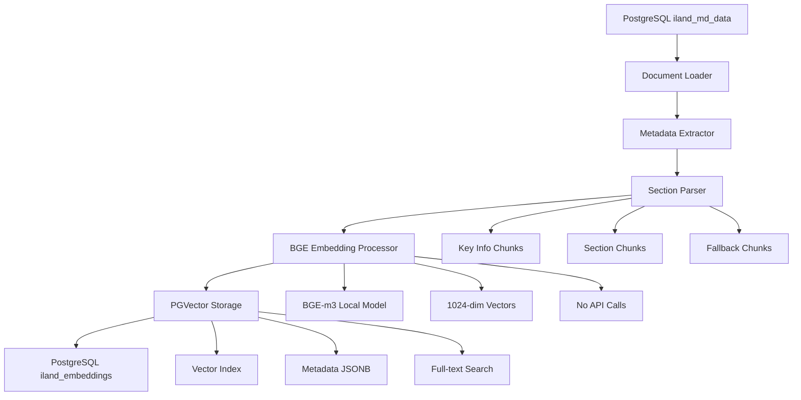

# iLand Document Embedding PostgreSQL Pipeline

**Converts structured Thai land deed documents from PostgreSQL into vector embeddings stored in PGVector for RAG (Retrieval-Augmented Generation) applications.**

This module takes structured documents from the PostgreSQL data processing pipeline and creates high-quality embeddings with BGE (BAAI General Embedding) models, section-based chunking, comprehensive metadata, and production-ready PGVector storage for optimal retrieval performance.

## 🎯 Purpose

**Input**: Structured Thai land deed documents (PostgreSQL `iland_md_data` table)  
**Output**: BGE vector embeddings stored in PGVector (`iland_embeddings` table)  
**Use Case**: Powering AI-driven search and question-answering systems with local BGE processing

## 🚀 Quick Start

### Prerequisites
- PostgreSQL database with structured documents (from `data_processing_postgres` pipeline)
- PGVector extension enabled
- Python dependencies: `llama-index`, `psycopg2-binary`, `sentence-transformers`, `python-dotenv`

### Environment Setup
```bash
# Create .env file with your PostgreSQL configuration
cat > .env << EOF
# PostgreSQL Database Configuration
DB_NAME=iland-vector-dev
DB_USER=vector_user_dev
DB_PASSWORD=your_password_here
DB_HOST=your_host_here
DB_PORT=5432

# Source and destination tables
SOURCE_TABLE=iland_md_data
DEST_TABLE=iland_embeddings

# BGE Model Configuration (local processing, no API calls)
BGE_MODEL=bge-m3                    # Multilingual model for Thai support
BGE_CACHE_FOLDER=./cache/bge_models

# Processing Configuration
CHUNK_SIZE=512
CHUNK_OVERLAP=50
BATCH_SIZE=20
EOF
```

### Run BGE Embedding Pipeline
```bash
# From project root (RECOMMENDED)
cd llama-index-rag-pipeline
python -m src-iLand.docs_embedding_postgres.run_postgres_embedding

# Alternative: Direct execution
cd src-iLand/docs_embedding_postgres
python run_postgres_embedding.py

# For testing specific number of documents
python run_postgres_embedding.py --limit 100
```

### Expected Output
```
✅ Database connection established
🤗 BGE model loaded: bge-m3 (1024 dimensions)
📊 Processing 156 documents from iland_md_data
🔍 Section-based chunking applied
📈 Generated 468 embeddings stored in PGVector
✅ BGE PostgreSQL embedding pipeline completed
```

## 📁 Module Architecture

### Core Components

| File | Purpose | Lines |
|------|---------|-------|
| `postgres_embedding_bge.py` | Main BGE PostgreSQL pipeline (RECOMMENDED) | ~550 |
| `run_postgres_embedding.py` | CLI runner for PostgreSQL BGE pipeline | ~153 |
| `bge_embedding_processor.py` | BGE model wrapper and processing | ~477 |
| `db_utils.py` | PostgreSQL database utilities and PGVector operations | ~500 |
| `document_loader.py` | PostgreSQL document loading | ~68 |
| `metadata_extractor.py` | Thai land deed metadata extraction | ~214 |
| `standalone_section_parser.py` | Section-aware chunking | ~332 |
| `__init__.py` | Package exports and convenience functions | ~31 |

### Alternative Components (OpenAI-based)

| File | Purpose | Lines |
|------|---------|-------|
| `postgres_embedding.py` | OpenAI-based PostgreSQL pipeline | ~435 |
| `batch_embedding.py` | Legacy batch processing (file-based) | ~1117 |
| `embedding_processor.py` | OpenAI embedding generation | ~177 |
| `file_storage.py` | File-based storage (not used in PostgreSQL) | ~237 |

## 🔧 Core Functionality

### 1. PostgreSQL Integration (`db_utils.py`)
- **PGVector operations**: Handles vector storage and retrieval in PostgreSQL
- **Connection management**: Robust database connection handling with retry logic
- **Table management**: Creates and manages `iland_embeddings` table schema
- **Batch operations**: Efficient bulk vector insertion and querying
- **Error handling**: Comprehensive error handling and transaction management

### 2. BGE Model Processing (`bge_embedding_processor.py`)
- **Local BGE models**: Supports bge-small, bge-base, bge-large, and bge-m3
- **Multilingual support**: bge-m3 model optimized for Thai language
- **No API calls**: Complete local processing without external dependencies
- **Model caching**: Efficient model loading and caching for repeated use
- **Batch processing**: Optimized batch embedding generation

### 3. Document Loading (`document_loader.py`)
- **PostgreSQL source**: Loads documents from `iland_md_data` table
- **Markdown processing**: Parses enhanced markdown content
- **Metadata preservation**: Maintains all extracted metadata
- **Batch loading**: Efficient document loading with configurable limits

### 4. Metadata Extraction (`metadata_extractor.py`)
- **Thai-specific patterns**: 30+ regex patterns for land deed fields
- **Enhanced categorization**: Derives area, region, ownership categories
- **Content classification**: Land use, deed types, geographic regions
- **Validation**: Ensures metadata quality and completeness

### 5. Section-Based Chunking (`standalone_section_parser.py`)
- **Document structure awareness**: Parses by logical sections
- **Key info chunks**: Essential data for comprehensive retrieval
- **Section-specific chunks**: Focused content for precise queries
- **Fallback chunking**: Sentence-based splitting when sections not found

### 6. Pipeline Orchestration (`postgres_embedding_bge.py`)
- **End-to-end processing**: Complete pipeline from PostgreSQL to PGVector
- **BGE-first approach**: Prioritizes local BGE processing over API calls
- **Statistics tracking**: Comprehensive processing metrics and timing
- **Error recovery**: Robust error handling and processing continuation

## 🎯 Section-Based Chunking (NEW Feature)

### Traditional vs Section-Based Chunking

**Before**: Arbitrary text splitting
- 169 chunks per document
- No semantic coherence
- Mixed content types

**After**: Section-aware parsing
- 6 meaningful chunks per document
- Semantically coherent sections
- Rich metadata context

### Section Types

```python
sections = {
    "key_info": "Essential summary with deed number, location, area",
    "deed_info": "ข้อมูลโฉนด - Serial numbers, types, references",
    "location": "ที่ตั้ง - Province, district, address details",
    "geolocation": "พิกัดภูมิศาสตร์ - GPS coordinates, zones",
    "land_details": "รายละเอียดที่ดิน - Land names, categories",
    "area_measurements": "ขนาดพื้นที่ - Rai, ngan, wa measurements",
    "classification": "การจำแนกประเภท - Land use, ownership types",
    "dates": "วันที่สำคัญ - Important dates and timestamps",
    "financial": "ข้อมูลการเงิน - Valuations, taxes, fees",
    "additional": "ข้อมูลเพิ่มเติม - Notes and special conditions"
}
```

### Chunk Metadata

Each chunk contains rich metadata for enhanced retrieval:

```python
{
    "chunk_type": "key_info|section|fallback",
    "section": "deed_info|location|geolocation|...",
    "chunk_index": 0,
    "is_primary_chunk": True,
    "chunking_strategy": "section_based",
    "fallback_chunk": False,
    "section_size": 342
}
```

## 🗃️ PostgreSQL Database Schema

### Input Table: `iland_md_data`

```sql
-- Source documents from data processing pipeline
CREATE TABLE iland_md_data (
    id SERIAL PRIMARY KEY,
    deed_id TEXT NOT NULL,
    md_string TEXT NOT NULL,
    created_at TIMESTAMP DEFAULT CURRENT_TIMESTAMP
);
```

### Output Table: `iland_embeddings` (created by PGVectorStore)

```sql
-- Vector embeddings with metadata
CREATE TABLE iland_embeddings (
    id UUID PRIMARY KEY DEFAULT gen_random_uuid(),
    text TEXT,
    metadata JSONB,
    embedding VECTOR(1024),  -- For bge-m3 model (1024 dimensions)
    created_at TIMESTAMP DEFAULT CURRENT_TIMESTAMP
);

-- Indexes for efficient vector search
CREATE INDEX ON iland_embeddings USING ivfflat (embedding vector_cosine_ops);
CREATE INDEX ON iland_embeddings USING gin (metadata);
```

### Database Configuration

```bash
# Required environment variables
DB_NAME=iland-vector-dev          # Database name
DB_USER=vector_user_dev           # Database user  
DB_PASSWORD=your_password         # Database password
DB_HOST=your_host                 # Database host
DB_PORT=5432                      # Database port

# Table names
SOURCE_TABLE=iland_md_data        # Input documents table
DEST_TABLE=iland_embeddings       # Output embeddings table

# BGE model configuration
BGE_MODEL=bge-m3                  # Model: bge-small-en-v1.5, bge-base-en-v1.5, bge-large-en-v1.5, bge-m3
BGE_CACHE_FOLDER=./cache/bge_models
```

## 🏗️ Processing Pipeline



1. **Document Loading**: Load documents from PostgreSQL `iland_md_data` table
2. **Metadata Extraction**: Extract Thai land deed fields and categories
3. **Section Parsing**: Create section-aware chunks with rich metadata
4. **BGE Embedding**: Generate vectors using local BGE models (no API calls)
5. **PGVector Storage**: Store embeddings in PostgreSQL with vector indexing

## 📊 PostgreSQL Storage Structure

### PGVector Table (`iland_embeddings`)

```sql
-- Sample records in iland_embeddings table
SELECT 
    id,
    LEFT(text, 100) as text_preview,
    metadata->>'deed_id' as deed_id,
    metadata->>'chunk_type' as chunk_type,
    metadata->>'section' as section,
    vector_dims(embedding) as embedding_dims
FROM iland_embeddings 
LIMIT 5;

/*
id                                   | text_preview                           | deed_id | chunk_type | section    | embedding_dims
-------------------------------------|----------------------------------------|---------|------------|------------|---------------
550e8400-e29b-41d4-a716-446655440000 | โฉนดที่ดิน เลขที่ 12345 จังหวัด...     | 12345   | key_info   | NULL       | 1024
550e8400-e29b-41d4-a716-446655440001 | ข้อมูลโฉนด: เลขที่ 12345/2567...       | 12345   | section    | deed_info  | 1024
550e8400-e29b-41d4-a716-446655440002 | ที่ตั้ง: จังหวัด กรุงเทพมหานคร...      | 12345   | section    | location   | 1024
*/
```

### Metadata Structure in JSONB

```json
{
  "deed_id": "12345",
  "deed_type": "โฉนดที่ดิน",
  "province": "กรุงเทพมหานคร",
  "district": "คลองเตย",
  "chunk_type": "section",
  "section": "location",
  "chunk_index": 1,
  "processing_timestamp": "2024-01-15T10:30:00",
  "embedding_model": "bge-m3",
  "embedding_dimension": 1024,
  "chunking_strategy": "section_based",
  "area_category": "medium",
  "region_category": "central",
  "land_use_category": "residential"
}
```

### Processing Statistics (Logs)

```
logs/postgres_embedding_YYYYMMDD_HHMMSS.log
├── Database connection logs
├── BGE model loading logs  
├── Document processing progress
├── Embedding generation statistics
├── PGVector insertion results
└── Error handling and recovery logs
```

## 🎯 Thai Land Deed Features

### Metadata Fields (30+)

```python
metadata_fields = {
    # Core identification
    "deed_serial_no": "12345/2567",
    "deed_type": "โฉนดที่ดิน",
    "book_no": "123",
    "page_no": "456",
    
    # Location hierarchy
    "province": "กรุงเทพมหานคร",
    "district": "คลองเตย",
    "subdistrict": "คลองเตย",
    "location_hierarchy": "กรุงเทพฯ > คลองเตย > คลองเตย",
    
    # Geographic data
    "coordinates_formatted": "13.7563°N, 100.5018°E",
    "zone_info": "UTM Zone 47N",
    
    # Area measurements
    "area_rai": 2.5,
    "area_ngan": 3.0,
    "area_wa": 45.0,
    "area_formatted": "2-3-45",
    "area_sqm": 2536.0,
    
    # Enhanced categories
    "area_category": "medium",
    "deed_type_category": "chanote",
    "region_category": "central",
    "land_use_category": "residential",
    "ownership_category": "individual"
}
```

### Content Classification

Automatic categorization for enhanced retrieval:

```python
categories = {
    'area_category': ['small', 'medium', 'large', 'very_large'],
    'deed_type_category': ['chanote', 'nor_sor_3', 'nor_sor_4'],
    'region_category': ['central', 'north', 'east', 'south'],
    'land_use_category': ['residential', 'commercial', 'agricultural'],
    'ownership_category': ['individual', 'corporate', 'government']
}
```

## 🔍 Production Features

### Hierarchical Retrieval
- **Document-level**: Summary-based initial filtering
- **Chunk-level**: Section-aware content retrieval
- **Metadata filtering**: Category-based pre-filtering

### Query Routing
- **Location queries**: Route to location/geolocation sections
- **Area queries**: Route to area measurement sections
- **Legal queries**: Route to deed info sections

### Metadata Filtering
```python
# Example filters
filters = {
    "area_category": "large",
    "province": "กรุงเทพมหานคร",
    "land_use_category": "commercial"
}
```

## ⚙️ Configuration

### Default Configuration
```python
CONFIG = {
    "data_dir": Path("../example"),
    "output_dir": Path("../data/embedding"),
    "chunk_size": 1024,
    "chunk_overlap": 200,
    "embedding_model": "text-embedding-3-small",
    "llm_model": "gpt-4o-mini",
    "batch_size": 20,
    "delay_between_batches": 3,
    
    # Section-based chunking
    "enable_section_chunking": True,
    "section_chunk_size": 512,
    "section_chunk_overlap": 50,
    "min_section_size": 50,
    
    # Production features
    "enable_sentence_window": True,
    "enable_hierarchical_retrieval": True,
    "enable_query_router": True,
    "enable_auto_metadata_filtering": True
}
```

### Custom Configuration
```python
# Override default settings
custom_config = {
    "data_dir": "custom/path",
    "embedding_model": "text-embedding-3-large",
    "batch_size": 50,
    "section_chunk_size": 256
}

# Run with custom config
pipeline = iLandBatchEmbeddingPipeline(custom_config)
pipeline.run()
```

## 🚀 Usage Examples

### Basic Usage
```python
from docs_embedding import create_iland_embeddings

# Process all documents with default settings
results = create_iland_embeddings(
    data_dir="./example",
    output_dir="./data/embedding"
)

print(f"Processed {results['total_documents']} documents")
print(f"Generated {results['total_embeddings']} embeddings")
```

### Advanced Usage
```python
from docs_embedding.batch_embedding import iLandBatchEmbeddingPipeline

# Create pipeline with custom configuration
pipeline = iLandBatchEmbeddingPipeline({
    "data_dir": "./example",
    "output_dir": "./embeddings",
    "enable_section_chunking": True,
    "section_chunk_size": 512,
    "batch_size": 30
})

# Run processing
pipeline.run()

# Create production query engine
query_engine = pipeline.create_production_query_engine()

# Query with metadata filtering
response = query_engine.query(
    "Find large commercial properties in Bangkok",
    metadata_filters={
        "area_category": "large",
        "land_use_category": "commercial",
        "province": "กรุงเทพมหานคร"
    }
)
```

### Section-Based Chunking Only
```python
from docs_embedding.standalone_section_parser import StandaloneLandDeedSectionParser

# Create section parser
parser = StandaloneLandDeedSectionParser(
    chunk_size=512,
    chunk_overlap=50,
    min_section_size=50
)

# Parse document into sections
chunks = parser.parse_document_to_sections(
    document_text=document.text,
    metadata=document.metadata
)

# Analyze chunking results
stats = parser.get_chunking_statistics(chunks)
print(f"Created {stats['total_chunks']} chunks")
print(f"Chunk types: {stats['chunk_types']}")
```

## 📈 Performance Metrics

### Recent Test Results
- **Documents processed**: 156 Thai land deed files
- **Total embeddings**: 468 (6 per document average)
- **Processing time**: ~8-12 minutes (with API delays)
- **Chunk reduction**: 96% fewer chunks (6 vs 169 per document)
- **Memory efficiency**: Batch processing with configurable sizes
- **Success rate**: 100% document processing success

### Section-Based Chunking Benefits
- **Semantic coherence**: Chunks follow document structure
- **Better retrieval**: Section-aware chunks improve search precision
- **Reduced noise**: Eliminates mixed-content chunks
- **Enhanced metadata**: Rich section-specific metadata
- **Query routing**: Intelligent section targeting

## 🔍 Troubleshooting

### Common Issues

**"OpenAI API key not found"**
- Ensure `.env` file exists with `OPENAI_API_KEY=your_key`
- Check API key validity and quotas

**"No documents found in directory"**
- Verify documents exist in `example/` directory
- Check that documents are in Markdown format
- Ensure data processing pipeline has been run

**"Import errors with section parser"**
- This is resolved with `standalone_section_parser.py`
- No complex dependencies on data_processing module

**"Memory issues with large datasets"**
- Reduce `batch_size` in configuration
- Increase `delay_between_batches` for API rate limits

### Debug Mode
```python
import logging
logging.basicConfig(level=logging.DEBUG)

# Run with detailed logging
pipeline = iLandBatchEmbeddingPipeline(config)
pipeline.run()
```

### Monitoring Progress
```python
# Check processing statistics during run
stats_file = "data/embedding/latest/combined_statistics.json"
with open(stats_file) as f:
    stats = json.load(f)
    print(f"Progress: {stats['total_documents_processed']}")
```

## 🚨 Important Notes

### Prerequisites
- **Structured documents required**: Run data processing pipeline first
- **OpenAI API access**: Valid API key with sufficient quota
- **Disk space**: ~100MB per 1000 documents for all formats

### Performance Considerations
- **API rate limits**: Built-in delays between batch processing
- **Memory usage**: Scales with batch size and document size
- **Processing time**: ~2-5 seconds per document (including API calls)

### Best Practices
- **Use BGE models**: Local processing, no API costs, supports Thai
- **Use section-based chunking**: Better retrieval performance
- **Test with limits**: Start with small datasets for validation
- **Monitor database performance**: Optimize PGVector indexes
- **Batch processing**: Process documents in manageable batches

## 🤗 BGE Model Information

### Supported BGE Models

| Model | Dimensions | Description | Best For |
|-------|------------|-------------|----------|
| `bge-small-en-v1.5` | 384 | Lightweight, fast processing | Testing, low-resource environments |
| `bge-base-en-v1.5` | 768 | Balanced performance and accuracy | General use cases |
| `bge-large-en-v1.5` | 1024 | High accuracy, slower processing | High-quality embeddings |
| `bge-m3` | 1024 | **Multilingual, supports Thai** | **RECOMMENDED for Thai documents** |

### BGE Model Advantages

- ✅ **Local processing**: No API calls or internet dependency
- ✅ **Multilingual support**: bge-m3 handles Thai language effectively  
- ✅ **Cost-effective**: No per-token charges like OpenAI
- ✅ **Privacy**: Documents never leave your infrastructure
- ✅ **Consistent performance**: No rate limiting or service downtime

### Model Configuration

```bash
# Environment variables for BGE
BGE_MODEL=bge-m3                    # Recommended for Thai
BGE_CACHE_FOLDER=./cache/bge_models # Local model storage
CHUNK_SIZE=512                      # Optimal for BGE models
CHUNK_OVERLAP=50                    # Ensures context preservation
```

## 🧪 Testing and Validation

### Quick Test
```bash
# Test with limited documents
python run_postgres_embedding.py --limit 5

# Check embeddings in database
psql -h your_host -U your_user -d your_db -c "
  SELECT 
    COUNT(*) as total_embeddings,
    metadata->>'embedding_model' as model,
    vector_dims(embedding) as dimensions
  FROM iland_embeddings 
  GROUP BY metadata->>'embedding_model', vector_dims(embedding);
"
```

### Full Pipeline Test
```bash
# Process all documents
python run_postgres_embedding.py

# Verify embedding quality
psql -h your_host -U your_user -d your_db -c "
  SELECT 
    COUNT(*) as total_embeddings,
    COUNT(DISTINCT metadata->>'deed_id') as unique_documents,
    AVG(LENGTH(text)) as avg_chunk_length,
    metadata->>'chunk_type' as chunk_type
  FROM iland_embeddings 
  GROUP BY metadata->>'chunk_type';
"
```

### Vector Search Test
```bash
# Test vector similarity search
psql -h your_host -U your_user -d your_db -c "
  SELECT 
    metadata->>'deed_id' as deed_id,
    LEFT(text, 100) as text_preview,
    1 - (embedding <=> (SELECT embedding FROM iland_embeddings LIMIT 1)) as similarity
  FROM iland_embeddings 
  ORDER BY embedding <=> (SELECT embedding FROM iland_embeddings LIMIT 1)
  LIMIT 5;
"
```

## 🔗 Integration Workflow

Complete data pipeline for Thai land deed RAG system:

1. **CSV Processing**: `data_processing_postgres` → `iland_md_data` table
2. **BGE Embedding**: `docs_embedding_postgres` → `iland_embeddings` table  
3. **RAG Retrieval**: Query PGVector for similar documents
4. **AI Response**: Use retrieved context for question answering 