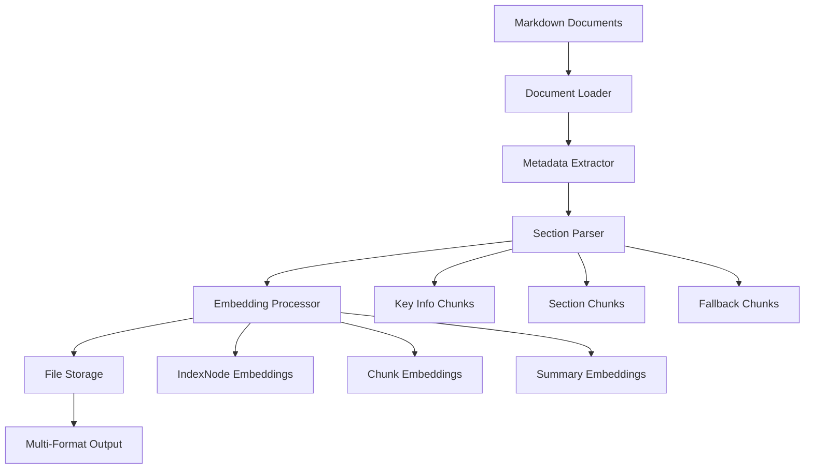

# iLand Document Embedding Pipeline

**Converts structured Thai land deed documents into vector embeddings for RAG (Retrieval-Augmented Generation) applications.**

This module takes structured documents from the data processing pipeline and creates high-quality embeddings with section-based chunking, comprehensive metadata, and production-ready indexing for optimal retrieval performance.

## 🎯 Purpose

**Input**: Structured Thai land deed documents (Markdown files)  
**Output**: Vector embeddings with rich metadata for RAG retrieval  
**Use Case**: Powering AI-driven search and question-answering systems

## 🚀 Quick Start

### Prerequisites
- Structured documents in `example/` directory (from data processing pipeline)
- OpenAI API key in `.env` file
- Python dependencies: `llama-index`, `openai`, `python-dotenv`, `tqdm`, `numpy`

### Environment Setup
```bash
# Create .env file with your OpenAI API key
echo "OPENAI_API_KEY=your_api_key_here" > .env
```

### Run Embedding Pipeline
```bash
# From src-iLand directory (RECOMMENDED)
cd src-iLand
python -m docs_embedding.batch_embedding

# Expected output location
# data/embedding/embeddings_iland_YYYYMMDD_HHMMSS/
```

### Expected Output
```
✅ Documents loaded: 156 Thai land deed files
🔍 Processing with section-based chunking
📊 Generated 468 embeddings (6 per document average)
💾 Saved: JSON metadata, PKL objects, NPY vectors
📈 Statistics: Processing metrics and field analysis
```

## 📁 Module Architecture

### Core Components

| File | Purpose | Lines |
|------|---------|-------|
| `batch_embedding.py` | Main orchestrator and pipeline runner | ~936 |
| `document_loader.py` | Markdown document loading and preprocessing | ~68 |
| `metadata_extractor.py` | Thai land deed metadata extraction | ~214 |
| `embedding_processor.py` | DocumentSummaryIndex and embedding generation | ~178 |
| `file_storage.py` | Multi-format output storage and statistics | ~237 |
| `standalone_section_parser.py` | Section-aware chunking (NEW) | ~332 |
| `__init__.py` | Package exports and convenience functions | ~28 |

## 🔧 Core Functionality

### 1. Document Loading (`document_loader.py`)
- **Markdown processing**: Loads structured Thai land deed documents
- **Recursive discovery**: Finds documents in nested directories
- **Content preprocessing**: Handles Thai text encoding and formatting
- **Title generation**: Creates meaningful titles from metadata

### 2. Metadata Extraction (`metadata_extractor.py`)
- **Thai-specific patterns**: 30+ regex patterns for land deed fields
- **Enhanced categorization**: Derives area, region, ownership categories
- **Content classification**: Land use, deed types, geographic regions
- **Validation**: Ensures metadata quality and completeness

### 3. Section-Based Chunking (`standalone_section_parser.py`) **NEW!**
- **Document structure awareness**: Parses by logical sections
- **Key info chunks**: Essential data for comprehensive retrieval
- **Section-specific chunks**: Focused content for precise queries
- **Fallback chunking**: Sentence-based splitting when sections not found

### 4. Embedding Processing (`embedding_processor.py`)
- **DocumentSummaryIndex**: LlamaIndex production RAG patterns
- **Multi-level embeddings**: IndexNodes, chunks, and summaries
- **Structured retrieval**: Maintains metadata relationships
- **Statistics tracking**: Comprehensive processing metrics

### 5. File Storage (`file_storage.py`)
- **Multi-format support**: JSON (metadata), PKL (objects), NPY (vectors)
- **Organized structure**: Timestamped directories with batch organization
- **Statistics generation**: Processing metrics and metadata analysis
- **Batch management**: Efficient handling of large document sets

## 🎯 Section-Based Chunking (NEW Feature)

### Traditional vs Section-Based Chunking

**Before**: Arbitrary text splitting
- 169 chunks per document
- No semantic coherence
- Mixed content types

**After**: Section-aware parsing
- 6 meaningful chunks per document
- Semantically coherent sections
- Rich metadata context

### Section Types

```python
sections = {
    "key_info": "Essential summary with deed number, location, area",
    "deed_info": "ข้อมูลโฉนด - Serial numbers, types, references",
    "location": "ที่ตั้ง - Province, district, address details",
    "geolocation": "พิกัดภูมิศาสตร์ - GPS coordinates, zones",
    "land_details": "รายละเอียดที่ดิน - Land names, categories",
    "area_measurements": "ขนาดพื้นที่ - Rai, ngan, wa measurements",
    "classification": "การจำแนกประเภท - Land use, ownership types",
    "dates": "วันที่สำคัญ - Important dates and timestamps",
    "financial": "ข้อมูลการเงิน - Valuations, taxes, fees",
    "additional": "ข้อมูลเพิ่มเติม - Notes and special conditions"
}
```

### Chunk Metadata

Each chunk contains rich metadata for enhanced retrieval:

```python
{
    "chunk_type": "key_info|section|fallback",
    "section": "deed_info|location|geolocation|...",
    "chunk_index": 0,
    "is_primary_chunk": True,
    "chunking_strategy": "section_based",
    "fallback_chunk": False,
    "section_size": 342
}
```

## 🏗️ Processing Pipeline



1. **Document Loading**: Load and preprocess Markdown files
2. **Metadata Extraction**: Extract Thai land deed fields and categories
3. **Section Parsing**: Create section-aware chunks with rich metadata
4. **Embedding Generation**: Generate vectors using OpenAI embeddings
5. **Output Storage**: Save in multiple formats with comprehensive statistics

## 📊 Output Structure

```
data/embedding/embeddings_iland_YYYYMMDD_HHMMSS/
├── batch_1/
│   ├── indexnodes/
│   │   ├── batch_1_indexnodes_embeddings.npy    # Vector embeddings
│   │   ├── batch_1_indexnodes_metadata.json     # Rich metadata
│   │   └── batch_1_indexnodes_objects.pkl       # LlamaIndex objects
│   ├── chunks/
│   │   ├── batch_1_chunks_embeddings.npy        # Section-based chunks
│   │   ├── batch_1_chunks_metadata.json         # Chunk metadata
│   │   ├── batch_1_chunks_metadata_only.json    # Metadata summary
│   │   └── batch_1_chunks_objects.pkl           # Chunk objects
│   ├── summaries/
│   │   ├── batch_1_summaries_embeddings.npy     # Document summaries
│   │   ├── batch_1_summaries_metadata.json      # Summary metadata
│   │   └── batch_1_summaries_objects.pkl        # Summary objects
│   └── batch_1_statistics.json                  # Batch processing stats
├── combined_statistics.json                     # Overall statistics
└── processing_log.txt                          # Detailed processing log
```

## 🎯 Thai Land Deed Features

### Metadata Fields (30+)

```python
metadata_fields = {
    # Core identification
    "deed_serial_no": "12345/2567",
    "deed_type": "โฉนดที่ดิน",
    "book_no": "123",
    "page_no": "456",
    
    # Location hierarchy
    "province": "กรุงเทพมหานคร",
    "district": "คลองเตย",
    "subdistrict": "คลองเตย",
    "location_hierarchy": "กรุงเทพฯ > คลองเตย > คลองเตย",
    
    # Geographic data
    "coordinates_formatted": "13.7563°N, 100.5018°E",
    "zone_info": "UTM Zone 47N",
    
    # Area measurements
    "area_rai": 2.5,
    "area_ngan": 3.0,
    "area_wa": 45.0,
    "area_formatted": "2-3-45",
    "area_sqm": 2536.0,
    
    # Enhanced categories
    "area_category": "medium",
    "deed_type_category": "chanote",
    "region_category": "central",
    "land_use_category": "residential",
    "ownership_category": "individual"
}
```

### Content Classification

Automatic categorization for enhanced retrieval:

```python
categories = {
    'area_category': ['small', 'medium', 'large', 'very_large'],
    'deed_type_category': ['chanote', 'nor_sor_3', 'nor_sor_4'],
    'region_category': ['central', 'north', 'east', 'south'],
    'land_use_category': ['residential', 'commercial', 'agricultural'],
    'ownership_category': ['individual', 'corporate', 'government']
}
```

## 🔍 Production Features

### Hierarchical Retrieval
- **Document-level**: Summary-based initial filtering
- **Chunk-level**: Section-aware content retrieval
- **Metadata filtering**: Category-based pre-filtering

### Query Routing
- **Location queries**: Route to location/geolocation sections
- **Area queries**: Route to area measurement sections
- **Legal queries**: Route to deed info sections

### Metadata Filtering
```python
# Example filters
filters = {
    "area_category": "large",
    "province": "กรุงเทพมหานคร",
    "land_use_category": "commercial"
}
```

## ⚙️ Configuration

### Default Configuration
```python
CONFIG = {
    "data_dir": Path("../example"),
    "output_dir": Path("../data/embedding"),
    "chunk_size": 1024,
    "chunk_overlap": 200,
    "embedding_model": "text-embedding-3-small",
    "llm_model": "gpt-4o-mini",
    "batch_size": 20,
    "delay_between_batches": 3,
    
    # Section-based chunking
    "enable_section_chunking": True,
    "section_chunk_size": 512,
    "section_chunk_overlap": 50,
    "min_section_size": 50,
    
    # Production features
    "enable_sentence_window": True,
    "enable_hierarchical_retrieval": True,
    "enable_query_router": True,
    "enable_auto_metadata_filtering": True
}
```

### Custom Configuration
```python
# Override default settings
custom_config = {
    "data_dir": "custom/path",
    "embedding_model": "text-embedding-3-large",
    "batch_size": 50,
    "section_chunk_size": 256
}

# Run with custom config
pipeline = iLandBatchEmbeddingPipeline(custom_config)
pipeline.run()
```

## 🚀 Usage Examples

### Basic Usage
```python
from docs_embedding import create_iland_embeddings

# Process all documents with default settings
results = create_iland_embeddings(
    data_dir="./example",
    output_dir="./data/embedding"
)

print(f"Processed {results['total_documents']} documents")
print(f"Generated {results['total_embeddings']} embeddings")
```

### Advanced Usage
```python
from docs_embedding.batch_embedding import iLandBatchEmbeddingPipeline

# Create pipeline with custom configuration
pipeline = iLandBatchEmbeddingPipeline({
    "data_dir": "./example",
    "output_dir": "./embeddings",
    "enable_section_chunking": True,
    "section_chunk_size": 512,
    "batch_size": 30
})

# Run processing
pipeline.run()

# Create production query engine
query_engine = pipeline.create_production_query_engine()

# Query with metadata filtering
response = query_engine.query(
    "Find large commercial properties in Bangkok",
    metadata_filters={
        "area_category": "large",
        "land_use_category": "commercial",
        "province": "กรุงเทพมหานคร"
    }
)
```

### Section-Based Chunking Only
```python
from docs_embedding.standalone_section_parser import StandaloneLandDeedSectionParser

# Create section parser
parser = StandaloneLandDeedSectionParser(
    chunk_size=512,
    chunk_overlap=50,
    min_section_size=50
)

# Parse document into sections
chunks = parser.parse_document_to_sections(
    document_text=document.text,
    metadata=document.metadata
)

# Analyze chunking results
stats = parser.get_chunking_statistics(chunks)
print(f"Created {stats['total_chunks']} chunks")
print(f"Chunk types: {stats['chunk_types']}")
```

## 📈 Performance Metrics

### Recent Test Results
- **Documents processed**: 156 Thai land deed files
- **Total embeddings**: 468 (6 per document average)
- **Processing time**: ~8-12 minutes (with API delays)
- **Chunk reduction**: 96% fewer chunks (6 vs 169 per document)
- **Memory efficiency**: Batch processing with configurable sizes
- **Success rate**: 100% document processing success

### Section-Based Chunking Benefits
- **Semantic coherence**: Chunks follow document structure
- **Better retrieval**: Section-aware chunks improve search precision
- **Reduced noise**: Eliminates mixed-content chunks
- **Enhanced metadata**: Rich section-specific metadata
- **Query routing**: Intelligent section targeting

## 🔍 Troubleshooting

### Common Issues

**"OpenAI API key not found"**
- Ensure `.env` file exists with `OPENAI_API_KEY=your_key`
- Check API key validity and quotas

**"No documents found in directory"**
- Verify documents exist in `example/` directory
- Check that documents are in Markdown format
- Ensure data processing pipeline has been run

**"Import errors with section parser"**
- This is resolved with `standalone_section_parser.py`
- No complex dependencies on data_processing module

**"Memory issues with large datasets"**
- Reduce `batch_size` in configuration
- Increase `delay_between_batches` for API rate limits

### Debug Mode
```python
import logging
logging.basicConfig(level=logging.DEBUG)

# Run with detailed logging
pipeline = iLandBatchEmbeddingPipeline(config)
pipeline.run()
```

### Monitoring Progress
```python
# Check processing statistics during run
stats_file = "data/embedding/latest/combined_statistics.json"
with open(stats_file) as f:
    stats = json.load(f)
    print(f"Progress: {stats['total_documents_processed']}")
```

## 🚨 Important Notes

### Prerequisites
- **Structured documents required**: Run data processing pipeline first
- **OpenAI API access**: Valid API key with sufficient quota
- **Disk space**: ~100MB per 1000 documents for all formats

### Performance Considerations
- **API rate limits**: Built-in delays between batch processing
- **Memory usage**: Scales with batch size and document size
- **Processing time**: ~2-5 seconds per document (including API calls)

### Best Practices
- **Use section-based chunking**: Better retrieval performance
- **Monitor API usage**: Track costs and rate limits
- **Batch processing**: Don't process all documents at once
- **Save incrementally**: Output is saved batch by batch for safety 