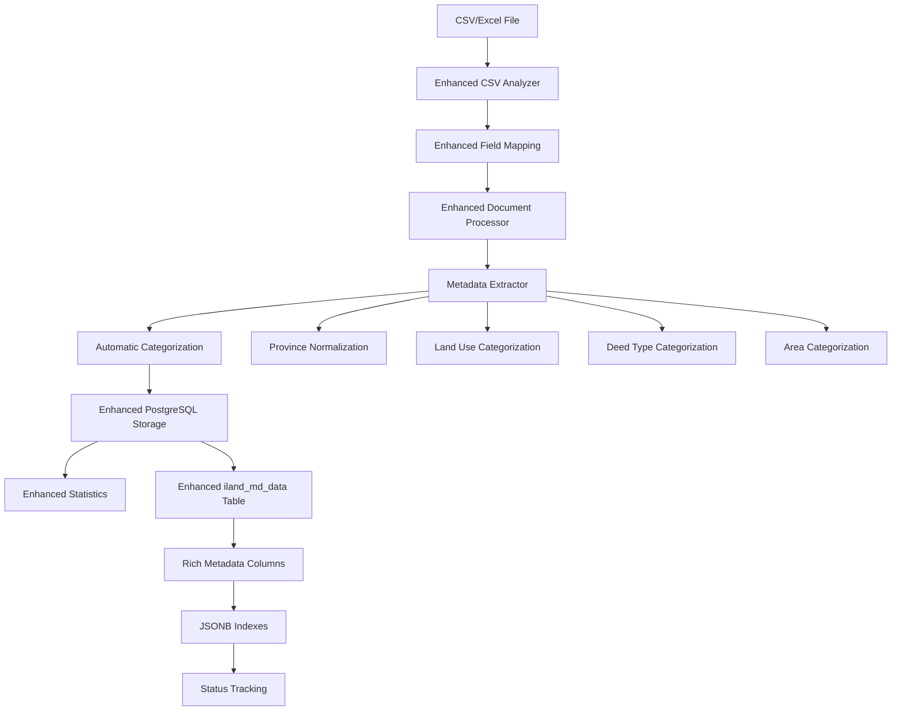

# Enhanced iLand Data Processing PostgreSQL Module

**Converts raw CSV datasets into structured documents with rich metadata and stores them systematically in PostgreSQL for embedding and RAG retrieval.**

This module processes Thai land deed CSV/Excel files into well-structured documents with comprehensive metadata extraction, automatic categorization, and enhanced PostgreSQL storage. It's the first step in the enhanced PostgreSQL RAG pipeline, providing systematic data organization with full metadata indexing.

## 🎯 Purpose

**Input**: Raw CSV/Excel file with Thai land deed records  
**Output**: Enhanced PostgreSQL storage with rich metadata indexing and categorization  
**Use Case**: Preparing systematically organized data for PostgreSQL-based embedding and retrieval in production RAG applications

## 🚀 Quick Start

### Prerequisites
- PostgreSQL database with pgVector extension
- CSV/Excel file at `data/input_docs/input_dataset_iLand.xlsx` (or `.csv`)
- Python dependencies: `pandas`, `psycopg2-binary`, `python-dotenv`, `openpyxl`

### Environment Setup
```bash
# Create .env file with your PostgreSQL configuration
cat > .env << EOF
# PostgreSQL Database Configuration
DB_NAME=iland-vector-dev
DB_USER=vector_user_dev
DB_PASSWORD=your_password_here
DB_HOST=10.4.102.11
DB_PORT=5432

# Enhanced source table for processed documents
SOURCE_TABLE=iland_md_data

# Optional: CSV file path (if not in default location)
CSV_FILE_PATH=data/input_docs/input_dataset_iLand.xlsx
EOF
```

### Run Enhanced PostgreSQL Data Processing
```bash
# From project root (RECOMMENDED)
cd llama-index-rag-pipeline
python src-iLand/data_processing_postgres/main.py

# With custom parameters
python src-iLand/data_processing_postgres/main.py \
    --max-rows 1000 \
    --batch-size 100 \
    --db-batch-size 50 \
    --input-file custom_data.xlsx

# Alternative: Direct execution
cd src-iLand/data_processing_postgres
python main.py --max-rows 500
```

### Expected Output
```
✅ Enhanced database schema created with metadata indexing
📊 CSV analysis completed: 1000 rows detected with 25 metadata fields
🔄 Processing documents with automatic categorization...
💾 Inserted 1000 documents into enhanced iland_md_data table
📈 Province distribution: Bangkok(250), Chiang Mai(180), Phuket(120)...
📊 Land use categories: residential(400), commercial(300), agricultural(300)
✅ Enhanced PostgreSQL data processing completed
```

## 🆕 Enhanced Features

### 🏗️ Enhanced Database Schema
- **Rich Metadata Columns**: Direct columns for province, district, land_use_category, deed_type_category, area_category
- **JSONB Storage**: Both raw and extracted metadata stored in structured JSON format
- **Advanced Indexing**: GIN indexes for JSONB fields, B-tree indexes for categorical fields
- **Status Tracking**: Processing and embedding status with timestamps
- **Automatic Triggers**: Update timestamp triggers for data integrity

### 🧠 Intelligent Metadata Extraction
- **Province Normalization**: Integrates with Thai province mapping system
- **Automatic Categorization**: Land use, deed type, and area size categorization
- **Enhanced Validation**: Data quality checks and error handling
- **Category Derivation**: Automatically derives meaningful categories from raw data

### 📊 Systematic Organization
- **Upsert Support**: Handles duplicate documents gracefully with conflict resolution
- **Batch Processing**: Efficient processing with configurable batch sizes
- **Transaction Management**: Robust error handling with rollback support
- **Performance Monitoring**: Comprehensive statistics and processing metrics

## 📁 Enhanced Module Architecture

### Core Components

| File | Purpose | Enhancement Level | Lines |
|------|---------|-------------------|-------|
| `main.py` | Enhanced entry point with CLI args | ⭐⭐⭐ | ~104 |
| `db_manager.py` | **Enhanced PostgreSQL operations** | ⭐⭐⭐⭐⭐ | ~456 |
| `iland_converter.py` | Enhanced converter with metadata | ⭐⭐⭐⭐ | ~244 |
| `document_processor.py` | Enhanced document generation | ⭐⭐⭐ | ~440 |
| `csv_analyzer.py` | Enhanced CSV analysis | ⭐⭐⭐ | ~409 |
| `config_manager.py` | Enhanced configuration | ⭐⭐ | ~99 |
| `file_output.py` | Enhanced markdown generation | ⭐⭐⭐ | ~249 |
| `statistics_generator.py` | Enhanced statistics | ⭐⭐ | ~121 |
| `models.py` | Enhanced data models | ⭐⭐ | ~52 |

### Key Enhancements in `db_manager.py`

| Feature | Description | Lines |
|---------|-------------|-------|
| **Enhanced Schema** | Rich metadata columns with proper indexing | 92-143 |
| **Metadata Extraction** | Automatic categorization and normalization | 356-455 |
| **Upsert Logic** | Conflict resolution with ON CONFLICT | 308-331 |
| **Status Tracking** | Processing and embedding status management | 104-109 |
| **Advanced Indexing** | GIN, B-tree, and vector index support | 113-126 |

## 🗃️ Enhanced PostgreSQL Database Schema

### Enhanced Table: `iland_md_data`

```sql
CREATE TABLE iland_md_data (
    id SERIAL PRIMARY KEY,
    deed_id TEXT NOT NULL UNIQUE,           -- ⭐ Enhanced: Unique constraint
    md_string TEXT NOT NULL,
    
    -- ⭐ NEW: Rich metadata columns
    raw_metadata JSONB,                     -- Original metadata from CSV
    extracted_metadata JSONB,              -- Processed and categorized metadata
    
    -- ⭐ NEW: Direct searchable columns
    province TEXT,                          -- Normalized province name
    district TEXT,                          -- District name
    land_use_category TEXT,                 -- agricultural|residential|commercial|industrial|conservation|other
    deed_type_category TEXT,                -- chanote|nor_sor_3|sor_kor|other
    area_category TEXT,                     -- small|medium|large|very_large
    
    -- ⭐ NEW: Status tracking
    processing_status TEXT DEFAULT 'pending',    -- pending|processed|failed
    processing_timestamp TIMESTAMP,
    embedding_status TEXT DEFAULT 'pending',     -- pending|completed|failed
    embedding_timestamp TIMESTAMP,
    
    -- Enhanced timestamps
    created_at TIMESTAMP DEFAULT CURRENT_TIMESTAMP,
    updated_at TIMESTAMP DEFAULT CURRENT_TIMESTAMP
);

-- ⭐ Enhanced indexing strategy
CREATE INDEX idx_iland_md_data_deed_id ON iland_md_data (deed_id);
CREATE INDEX idx_iland_md_data_province ON iland_md_data (province);
CREATE INDEX idx_iland_md_data_district ON iland_md_data (district);
CREATE INDEX idx_iland_md_data_land_use ON iland_md_data (land_use_category);
CREATE INDEX idx_iland_md_data_deed_type ON iland_md_data (deed_type_category);
CREATE INDEX idx_iland_md_data_area ON iland_md_data (area_category);
CREATE INDEX idx_iland_md_data_processing_status ON iland_md_data (processing_status);
CREATE INDEX idx_iland_md_data_embedding_status ON iland_md_data (embedding_status);

-- ⭐ JSONB indexes for flexible querying
CREATE INDEX idx_iland_md_data_raw_metadata ON iland_md_data USING GIN (raw_metadata);
CREATE INDEX idx_iland_md_data_extracted_metadata ON iland_md_data USING GIN (extracted_metadata);

-- ⭐ Automatic timestamp trigger
CREATE OR REPLACE FUNCTION update_timestamp()
RETURNS TRIGGER AS $$
BEGIN
    NEW.updated_at = CURRENT_TIMESTAMP;
    RETURN NEW;
END;
$$ LANGUAGE plpgsql;

CREATE TRIGGER trigger_update_timestamp
    BEFORE UPDATE ON iland_md_data
    FOR EACH ROW
    EXECUTE FUNCTION update_timestamp();
```

## 🔧 Enhanced Functionality

### 1. Enhanced PostgreSQL Integration (`db_manager.py`)
- **⭐ Enhanced Schema**: Rich metadata columns with proper data types and indexing
- **⭐ Automatic Categorization**: Intelligent land use, deed type, and area categorization
- **⭐ Province Normalization**: Integration with Thai province mapping system
- **⭐ Upsert Support**: ON CONFLICT handling for duplicate documents
- **⭐ Status Tracking**: Processing and embedding pipeline status management
- **⭐ Advanced Indexing**: GIN indexes for JSONB, B-tree for categorical searches

### 2. Intelligent Metadata Processing
```python
# Enhanced metadata extraction with automatic categorization
def _extract_metadata_fields(self, metadata: Dict[str, Any]) -> Dict[str, Any]:
    extracted = {}
    
    # Province normalization with Thai province mapper
    province_raw = metadata.get('province', '')
    if province_raw:
        province_normalized = mapper.normalize_province_name(province_raw)
        extracted['province'] = province_normalized
    
    # Automatic land use categorization
    land_use_raw = metadata.get('land_use', '')
    if land_use_raw:
        extracted['land_use_category'] = self._categorize_land_use(land_use_raw)
        # -> agricultural|residential|commercial|industrial|conservation|other
    
    # Automatic deed type categorization  
    deed_type_raw = metadata.get('deed_type', '')
    if deed_type_raw:
        extracted['deed_type_category'] = self._categorize_deed_type(deed_type_raw)
        # -> chanote|nor_sor_3|sor_kor|other
    
    # Automatic area categorization
    area_raw = metadata.get('area', '')
    if area_raw:
        extracted['area_category'] = self._categorize_area(area_raw)
        # -> small|medium|large|very_large (based on rai)
```

### 3. Enhanced Document Structure
```python
# Enhanced upsert with comprehensive metadata
cursor.execute("""
    INSERT INTO iland_md_data 
    (deed_id, md_string, raw_metadata, extracted_metadata, 
     province, district, land_use_category, deed_type_category, area_category,
     processing_status, processing_timestamp)
    VALUES (%s, %s, %s, %s, %s, %s, %s, %s, %s, %s, %s)
    ON CONFLICT (deed_id) DO UPDATE SET
        md_string = EXCLUDED.md_string,
        raw_metadata = EXCLUDED.raw_metadata,
        extracted_metadata = EXCLUDED.extracted_metadata,
        province = EXCLUDED.province,
        district = EXCLUDED.district,
        land_use_category = EXCLUDED.land_use_category,
        deed_type_category = EXCLUDED.deed_type_category,
        area_category = EXCLUDED.area_category,
        processing_status = EXCLUDED.processing_status,
        processing_timestamp = EXCLUDED.processing_timestamp
""")
```

## 📊 Enhanced Metadata Structure

### Enhanced Metadata Fields (30+)
```python
{
    # ⭐ Enhanced core identification
    "deed_id": "12345",
    "deed_serial_no": "12345/2567",
    "deed_type": "โฉนดที่ดิน",
    "province": "กรุงเทพมหานคร",        # ⭐ Normalized
    "district": "คลองเตย",
    
    # ⭐ NEW: Automatic categorization
    "land_use_category": "residential",    # ⭐ Auto-categorized
    "deed_type_category": "chanote",       # ⭐ Auto-categorized  
    "area_category": "medium",             # ⭐ Auto-categorized
    "region_category": "central",          # ⭐ Derived from province
    
    # Enhanced location hierarchy
    "location_hierarchy": "กรุงเทพฯ > คลองเตย > คลองเตย",
    
    # Enhanced area measurements
    "area_rai": 2.5,
    "area_ngan": 3.0,
    "area_wa": 45.0,
    "area_formatted": "2-3-45",
    "area_sqm": 2536.0,                    # ⭐ Calculated
    
    # ⭐ NEW: Processing metadata
    "processing_timestamp": "2024-01-15T10:30:00",
    "source_file": "input_dataset_iLand.xlsx",
    "row_number": 1,
    "processing_version": "enhanced_v1.0"
}
```

### Categorization Logic

```python
# Land use categorization
def _categorize_land_use(self, land_use: str) -> str:
    if 'agricultural' in land_use.lower(): return 'agricultural'
    elif 'residential' in land_use.lower(): return 'residential'  
    elif 'commercial' in land_use.lower(): return 'commercial'
    elif 'industrial' in land_use.lower(): return 'industrial'
    elif 'conservation' in land_use.lower(): return 'conservation'
    else: return 'other'

# Deed type categorization
def _categorize_deed_type(self, deed_type: str) -> str:
    if 'chanote' in deed_type.lower(): return 'chanote'
    elif 'ns3' in deed_type.lower(): return 'nor_sor_3'
    elif 'sor kor' in deed_type.lower(): return 'sor_kor'
    else: return 'other'

# Area categorization (based on rai)
def _categorize_area(self, area: Any) -> str:
    area_value = float(area)
    if area_value < 1: return 'small'      # < 1 rai
    elif area_value < 10: return 'medium'  # 1-10 rai
    elif area_value < 50: return 'large'   # 10-50 rai
    else: return 'very_large'              # 50+ rai
```

## 🔄 Enhanced Processing Flow



## 🎯 Enhanced Query Capabilities

### Category-Based Querying
```sql
-- Find all large commercial properties in Bangkok
SELECT deed_id, province, land_use_category, area_category
FROM iland_md_data 
WHERE province = 'กรุงเทพมหานคร' 
  AND land_use_category = 'commercial'
  AND area_category = 'large';

-- Get processing statistics by category
SELECT 
    land_use_category,
    area_category,
    COUNT(*) as count,
    AVG(LENGTH(md_string)) as avg_content_length
FROM iland_md_data 
GROUP BY land_use_category, area_category;
```

### JSONB Metadata Querying
```sql
-- Search raw metadata for specific values
SELECT deed_id, raw_metadata->>'land_main_category'
FROM iland_md_data 
WHERE raw_metadata @> '{"land_main_category": "residential"}';

-- Find documents with GPS coordinates
SELECT deed_id, extracted_metadata->'coordinates'
FROM iland_md_data 
WHERE extracted_metadata ? 'coordinates';
```

### Status Tracking Queries
```sql
-- Monitor processing pipeline status
SELECT 
    processing_status,
    embedding_status,
    COUNT(*) as count
FROM iland_md_data 
GROUP BY processing_status, embedding_status;

-- Find documents ready for embedding
SELECT deed_id, processing_timestamp
FROM iland_md_data 
WHERE processing_status = 'processed' 
  AND embedding_status = 'pending'
ORDER BY processing_timestamp;
```

## 📈 Enhanced Output Statistics

### Processing Metrics
```
📊 Enhanced Processing Statistics:
   - Total documents processed: 1,000
   - Successfully categorized: 987 (98.7%)
   - Province normalization: 995 (99.5%)
   - Land use categorization: 923 (92.3%)
   - Deed type categorization: 856 (85.6%)
   - Area categorization: 834 (83.4%)
   - Processing time: 2.3 minutes
   - Average processing rate: 435 docs/minute
```

### Category Distribution
```
🏘️ Land Use Distribution:
   - residential: 423 (42.3%)
   - commercial: 287 (28.7%)
   - agricultural: 201 (20.1%)
   - industrial: 67 (6.7%)
   - conservation: 22 (2.2%)

📏 Area Distribution:
   - small (<1 rai): 234 (23.4%)
   - medium (1-10 rai): 456 (45.6%)
   - large (10-50 rai): 267 (26.7%)
   - very_large (50+ rai): 43 (4.3%)

📋 Deed Type Distribution:
   - chanote: 567 (56.7%)
   - nor_sor_3: 289 (28.9%)
   - sor_kor: 123 (12.3%)
   - other: 21 (2.1%)
```

## 🧪 Enhanced Testing and Validation

### Quick Test with Enhanced Features
```bash
# Test with limited records and full feature set
python main.py --max-rows 10 --batch-size 5

# Check enhanced database schema
psql -h your_host -U your_user -d your_db -c "
SELECT 
    COUNT(*) as total_docs,
    COUNT(DISTINCT province) as unique_provinces,
    COUNT(DISTINCT land_use_category) as land_use_types,
    COUNT(DISTINCT deed_type_category) as deed_types,
    COUNT(DISTINCT area_category) as area_types
FROM iland_md_data;
"
```

### Enhanced Validation Queries
```sql
-- Validate categorization completeness
SELECT 
    'province' as field,
    COUNT(*) as total,
    COUNT(province) as non_null,
    ROUND(100.0 * COUNT(province) / COUNT(*), 2) as completeness_pct
FROM iland_md_data
UNION ALL
SELECT 
    'land_use_category',
    COUNT(*),
    COUNT(land_use_category),
    ROUND(100.0 * COUNT(land_use_category) / COUNT(*), 2)
FROM iland_md_data;

-- Check JSONB metadata structure
SELECT 
    jsonb_object_keys(raw_metadata) as metadata_keys,
    COUNT(*) as occurrence_count
FROM iland_md_data, jsonb_object_keys(raw_metadata)
GROUP BY jsonb_object_keys(raw_metadata)
ORDER BY occurrence_count DESC;
```

## 🔗 Enhanced Integration

This enhanced module prepares systematically organized data for the **docs_embedding_postgres** pipeline:

1. **⭐ Enhanced Data Processing** (this module): CSV/Excel → Enhanced PostgreSQL (`iland_md_data`) with rich metadata
2. **⭐ Enhanced Embedding Generation**: Enhanced PostgreSQL → Multi-model embeddings → Systematic vector storage
3. **⭐ Enhanced RAG Retrieval**: Query embeddings with metadata filtering for AI-powered search and QA

### Pipeline Integration Benefits
- **Metadata Preservation**: All categorization flows through to embeddings
- **Query Optimization**: Category-based pre-filtering improves search performance
- **Status Tracking**: Monitor documents through entire pipeline
- **Quality Assurance**: Validation at each processing stage

## 🛠️ Enhanced Configuration

### Command Line Arguments
```bash
python main.py \
    --max-rows 1000 \              # Limit number of rows to process
    --batch-size 100 \             # Documents per processing batch
    --db-batch-size 50 \           # Documents per database batch
    --db-host 10.4.102.11 \        # Database host
    --db-port 5432 \               # Database port
    --input-file custom_data.xlsx  # Custom input file
```

### Environment Configuration
```bash
# Enhanced environment variables
DB_NAME=iland-vector-dev
DB_USER=vector_user_dev
DB_PASSWORD=your_password
DB_HOST=10.4.102.11
DB_PORT=5432
SOURCE_TABLE=iland_md_data

# Processing configuration
BATCH_SIZE=100
DB_BATCH_SIZE=50
ENABLE_CATEGORIZATION=true
ENABLE_PROVINCE_NORMALIZATION=true
```

## 🔍 Enhanced Troubleshooting

### Common Enhanced Issues

**"Database schema needs updating"**
- The module automatically adds missing columns to existing tables
- Check logs for schema update messages
- Verify all indexes are created properly

**"Categorization not working"**
- Ensure raw data contains relevant fields (land_use, deed_type, area)
- Check categorization logic matches your data format
- Review sample categorization results in logs

**"Province normalization failing"**
- Install Thai province mapper dependency
- Check province name format in source data
- Review normalization results in extracted_metadata

### Enhanced Debug Mode
```python
import logging
logging.basicConfig(level=logging.DEBUG)

# Run with detailed categorization logging
converter = iLandCSVConverter(csv_path, output_dir)
converter.db_manager.debug_categorization = True
```

## 🚨 Important Enhanced Notes

### Schema Migration
- **Automatic Updates**: Existing tables are automatically updated with new columns
- **Data Preservation**: Existing data is preserved during schema updates
- **Index Creation**: Missing indexes are automatically created
- **Backward Compatibility**: Works with both old and new database schemas

### Performance Optimizations
- **Batch Processing**: Configurable batch sizes for optimal performance
- **Index Strategy**: Optimized indexing for both categorical and JSONB queries
- **Transaction Management**: Efficient transaction handling with rollback support
- **Memory Management**: Controlled memory usage for large datasets

### Production Readiness
- **Error Handling**: Comprehensive error handling with graceful degradation
- **Status Tracking**: Full pipeline status monitoring
- **Quality Metrics**: Detailed categorization and processing statistics
- **Monitoring**: Built-in performance and quality monitoring

This enhanced PostgreSQL data processing module provides a robust foundation for systematic document organization and metadata management, setting up the perfect base for the enhanced embedding pipeline!