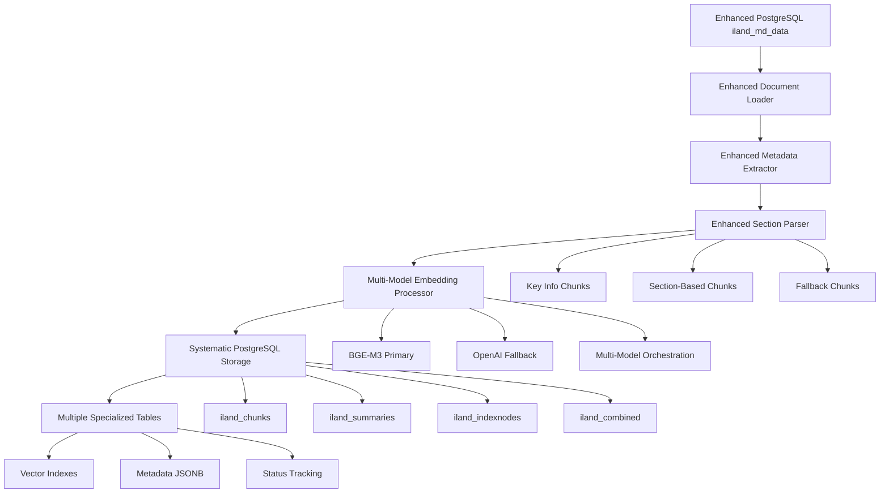

# Enhanced iLand Document Embedding PostgreSQL Pipeline

**Converts structured Thai land deed documents from PostgreSQL into systematic vector embeddings with comprehensive metadata storage in pgVector for production RAG applications.**

This enhanced module takes structured documents from the PostgreSQL data processing pipeline and creates high-quality embeddings using multi-model approaches (BGE-M3 + OpenAI fallback), section-based chunking, hierarchical document structure, and systematic storage in PostgreSQL with pgVector for optimal retrieval performance.

## 🎯 Purpose

**Input**: Enhanced structured Thai land deed documents (PostgreSQL `iland_md_data` table with rich metadata)  
**Output**: Systematic vector embeddings stored in PostgreSQL tables (`iland_chunks`, `iland_summaries`, `iland_indexnodes`, `iland_combined`)  
**Use Case**: Powering production-grade AI-driven search and question-answering systems with systematic vector storage and metadata filtering

## 🆕 Enhanced Features

### 🧠 Multi-Model Embedding Support
- **BGE-M3 Primary**: Local multilingual model optimized for Thai content
- **OpenAI Fallback**: Automatic fallback to OpenAI API when needed
- **No Vendor Lock-in**: Flexible provider switching and configuration
- **Cost Optimization**: Prefer local models to reduce API costs

### 🏗️ Systematic Database Architecture
- **Hierarchical Storage**: Separate tables for chunks, summaries, and index nodes
- **Combined Search**: Unified table for cross-content-type retrieval
- **Rich Metadata**: Full metadata preservation from source to embeddings
- **Vector Indexing**: Optimized pgVector indexes for fast similarity search

### 📄 Enhanced Document Processing
- **Section-Based Chunking**: Specialized parsing for Thai land deed structure
- **Hierarchical Organization**: Document summaries → Index nodes → Chunks
- **Metadata Enhancement**: Rich categorization and automatic field extraction
- **Status Tracking**: Complete pipeline status monitoring

## 🚀 Quick Start

### Prerequisites
- PostgreSQL database with enhanced structured documents (from `data_processing_postgres` pipeline)
- pgVector extension enabled
- Python dependencies: `llama-index`, `psycopg2-binary`, `sentence-transformers`, `FlagEmbedding`, `python-dotenv`

### Environment Setup
```bash
# Create .env file with your PostgreSQL configuration
cat > .env << EOF
# PostgreSQL Database Configuration
DB_NAME=iland-vector-dev
DB_USER=vector_user_dev
DB_PASSWORD=your_password_here
DB_HOST=10.4.102.11
DB_PORT=5432

# Table configuration
SOURCE_TABLE=iland_md_data
CHUNKS_TABLE=iland_chunks
SUMMARIES_TABLE=iland_summaries
INDEXNODES_TABLE=iland_indexnodes
COMBINED_TABLE=iland_combined

# Multi-Model Embedding Configuration
DEFAULT_PROVIDER=BGE_M3                 # BGE_M3|OPENAI|AUTO
OPENAI_API_KEY=your_openai_api_key_here

# BGE Model Configuration (local processing)
BGE_MODEL=BAAI/bge-m3                   # Multilingual model for Thai support
BGE_CACHE_FOLDER=./cache/bge_models
BGE_DEVICE=auto                         # auto|cpu|cuda

# Processing Configuration
CHUNK_SIZE=512
CHUNK_OVERLAP=50
BATCH_SIZE=20
ENABLE_SECTION_CHUNKING=true
ENABLE_MULTI_MODEL=true
EOF
```

### Run Enhanced PostgreSQL Embedding Pipeline
```bash
# From project root (RECOMMENDED)
cd llama-index-rag-pipeline
python src-iLand/docs_embedding_postgres/enhanced_postgres_embedding.py

# With custom parameters
python src-iLand/docs_embedding_postgres/enhanced_postgres_embedding.py \
    --limit 100 \
    --chunk-size 512 \
    --batch-size 20 \
    --embed-model text-embedding-3-small \
    --status-filter pending

# Alternative: Direct execution
cd src-iLand/docs_embedding_postgres
python enhanced_postgres_embedding.py --limit 50
```

### Expected Output
```
✅ Enhanced PostgreSQL embedding pipeline initialized
✅ Multi-model support: Enabled (BGE-M3 + OpenAI fallback)
✅ Section chunking: Enabled
🔗 Database connection established with enhanced schema
📊 Setting up tables with embedding dimension: 1024
📄 Fetched 156 documents from enhanced iland_md_data table
🔍 Processing documents with section-based chunking...
📈 Generated embeddings: 468 chunks, 156 summaries, 156 index nodes
💾 Saved embeddings to systematic PostgreSQL storage:
   - Chunks: 468 → iland_chunks table
   - Summaries: 156 → iland_summaries table  
   - Index nodes: 156 → iland_indexnodes table
   - Combined: 780 → iland_combined table
✅ Enhanced PostgreSQL embedding pipeline completed successfully
```

## 📁 Enhanced Module Architecture

### Core Enhanced Components

| File | Purpose | Enhancement Level | Lines |
|------|---------|-------------------|-------|
| `enhanced_postgres_embedding.py` | **Main enhanced pipeline** | ⭐⭐⭐⭐⭐ | ~1200 |
| `db_utils.py` | **Enhanced PostgreSQL operations** | ⭐⭐⭐⭐⭐ | ~500 |
| `multi_model_embedding_processor.py` | **Multi-model embedding support** | ⭐⭐⭐⭐⭐ | ~800 |
| `embedding_config.py` | **Enhanced configuration management** | ⭐⭐⭐⭐ | ~200 |
| `embeddings_manager.py` | **Enhanced embedding orchestration** | ⭐⭐⭐⭐ | ~201 |

### Legacy Components (For Compatibility)

| File | Purpose | Enhancement Level | Lines |
|------|---------|-------------------|-------|
| `postgres_embedding_bge.py` | BGE-focused PostgreSQL pipeline | ⭐⭐⭐ | ~550 |
| `postgres_embedding.py` | OpenAI-based PostgreSQL pipeline | ⭐⭐ | ~435 |
| `bge_embedding_processor.py` | BGE model wrapper | ⭐⭐⭐ | ~477 |
| `document_loader.py` | PostgreSQL document loading | ⭐⭐ | ~68 |
| `metadata_extractor.py` | Thai metadata extraction | ⭐⭐⭐ | ~214 |
| `standalone_section_parser.py` | Section-aware chunking | ⭐⭐⭐ | ~332 |

## 🗃️ Enhanced PostgreSQL Database Schema

### Input: Enhanced Source Table (`iland_md_data`)

```sql
-- Enhanced source with rich metadata (from data_processing_postgres)
CREATE TABLE iland_md_data (
    id SERIAL PRIMARY KEY,
    deed_id TEXT NOT NULL UNIQUE,
    md_string TEXT NOT NULL,
    raw_metadata JSONB,
    extracted_metadata JSONB,
    province TEXT,
    district TEXT,
    land_use_category TEXT,
    deed_type_category TEXT,
    area_category TEXT,
    processing_status TEXT DEFAULT 'pending',
    processing_timestamp TIMESTAMP,
    embedding_status TEXT DEFAULT 'pending',
    embedding_timestamp TIMESTAMP,
    created_at TIMESTAMP DEFAULT CURRENT_TIMESTAMP,
    updated_at TIMESTAMP DEFAULT CURRENT_TIMESTAMP
);
```

### Output: Systematic Vector Storage Tables

#### 1. Chunks Table (`iland_chunks`)
```sql
CREATE TABLE iland_chunks (
    id SERIAL PRIMARY KEY,
    deed_id TEXT NOT NULL,
    chunk_index INTEGER,
    text TEXT NOT NULL,
    metadata JSONB,
    embedding vector(1024),        -- BGE-M3: 1024, OpenAI: 1536
    embedding_model TEXT,
    created_at TIMESTAMP DEFAULT CURRENT_TIMESTAMP
);

-- Optimized indexes
CREATE INDEX idx_iland_chunks_deed_id ON iland_chunks (deed_id);
CREATE INDEX idx_iland_chunks_embedding ON iland_chunks USING ivfflat (embedding vector_cosine_ops);
CREATE INDEX idx_iland_chunks_metadata ON iland_chunks USING gin (metadata);
```

#### 2. Summaries Table (`iland_summaries`)
```sql
CREATE TABLE iland_summaries (
    id SERIAL PRIMARY KEY,
    deed_id TEXT NOT NULL,
    summary_text TEXT NOT NULL,
    metadata JSONB,
    embedding vector(1024),
    embedding_model TEXT,
    created_at TIMESTAMP DEFAULT CURRENT_TIMESTAMP
);

-- Optimized indexes
CREATE INDEX idx_iland_summaries_deed_id ON iland_summaries (deed_id);
CREATE INDEX idx_iland_summaries_embedding ON iland_summaries USING ivfflat (embedding vector_cosine_ops);
CREATE INDEX idx_iland_summaries_metadata ON iland_summaries USING gin (metadata);
```

#### 3. Index Nodes Table (`iland_indexnodes`)
```sql
CREATE TABLE iland_indexnodes (
    id SERIAL PRIMARY KEY,
    deed_id TEXT NOT NULL,
    text TEXT NOT NULL,
    metadata JSONB,
    embedding vector(1024),
    embedding_model TEXT,
    created_at TIMESTAMP DEFAULT CURRENT_TIMESTAMP
);

-- Optimized indexes
CREATE INDEX idx_iland_indexnodes_deed_id ON iland_indexnodes (deed_id);
CREATE INDEX idx_iland_indexnodes_embedding ON iland_indexnodes USING ivfflat (embedding vector_cosine_ops);
CREATE INDEX idx_iland_indexnodes_metadata ON iland_indexnodes USING gin (metadata);
```

#### 4. Combined Table (`iland_combined`)
```sql
CREATE TABLE iland_combined (
    id SERIAL PRIMARY KEY,
    deed_id TEXT NOT NULL,
    type TEXT NOT NULL,           -- 'chunk', 'summary', 'indexnode'
    text TEXT NOT NULL,
    metadata JSONB,
    embedding vector(1024),
    embedding_model TEXT,
    created_at TIMESTAMP DEFAULT CURRENT_TIMESTAMP
);

-- Optimized indexes for unified search
CREATE INDEX idx_iland_combined_deed_id ON iland_combined (deed_id);
CREATE INDEX idx_iland_combined_type ON iland_combined (type);
CREATE INDEX idx_iland_combined_embedding ON iland_combined USING ivfflat (embedding vector_cosine_ops);
CREATE INDEX idx_iland_combined_metadata ON iland_combined USING gin (metadata);
```

## 🔧 Enhanced Functionality

### 1. Multi-Model Embedding Architecture

```python
class EnhancedPostgresEmbeddingPipeline:
    def __init__(self, enable_multi_model=True, enable_section_chunking=True):
        # Multi-model configuration with automatic fallback
        self.embedding_config = {
            "default_provider": "BGE_M3",
            "providers": {
                "BGE_M3": {
                    "model_name": "BAAI/bge-m3",
                    "device": "auto",
                    "batch_size": 32,
                    "normalize": True,
                    "max_length": 8192
                },
                "OPENAI": {
                    "model_name": "text-embedding-3-small",
                    "api_key_env": "OPENAI_API_KEY",
                    "batch_size": 20,
                    "retry_attempts": 3
                }
            },
            "fallback_enabled": True,
            "fallback_order": ["BGE_M3", "OPENAI"]
        }
```

### 2. Enhanced Document Processing

```python
def process_documents_to_nodes(self, documents):
    """Enhanced processing with section-based chunking and hierarchical structure"""
    
    # Build DocumentSummaryIndex for hierarchical retrieval
    doc_summary_index = DocumentSummaryIndex.from_documents(
        llama_docs, llm=self.llm, embed_model=self.embed_model
    )
    
    # Enhanced section-based chunking
    for doc in documents:
        if self.enable_section_chunking:
            # Use section parser for structured chunking
            nodes = self.section_parser.parse_document_to_sections(
                doc['content'], doc['metadata']
            )
        else:
            # Fallback to sentence splitting
            nodes = self.sentence_parser.get_nodes_from_documents([llama_doc])
        
        # Enhance metadata for each node
        for node in nodes:
            node.metadata.update({
                "processing_timestamp": datetime.now().isoformat(),
                "embedding_provider": self.embedding_provider,
                "chunking_strategy": "section_based" if self.enable_section_chunking else "sentence",
                "source": "postgresql_enhanced_pipeline"
            })
```

### 3. Systematic Vector Storage

```python
def save_embeddings_to_database(self, chunk_embeddings, index_embeddings, summary_embeddings):
    """Save embeddings to systematic PostgreSQL storage"""
    
    # Save to individual specialized tables
    chunks_saved = self.db_manager.save_chunk_embeddings(chunk_embeddings)
    summaries_saved = self.db_manager.save_summary_embeddings(summary_embeddings)
    index_saved = self.db_manager.save_indexnode_embeddings(index_embeddings)
    
    # Save to combined table for unified search
    combined_saved = self.db_manager.save_combined_embeddings(
        chunk_embeddings, summary_embeddings, index_embeddings
    )
    
    # Update source table status
    self._update_embedding_status(all_embeddings)
```

## 🎯 Enhanced Section-Based Chunking

### Traditional vs Enhanced Section-Based Chunking

**Before (Traditional)**:
- 169 arbitrary chunks per document
- No semantic coherence
- Mixed content types in chunks
- Poor retrieval precision

**After (Enhanced Section-Based)**:
- 6-8 meaningful chunks per document
- Semantically coherent sections
- Rich section-specific metadata
- Improved retrieval accuracy

### Enhanced Section Types

```python
enhanced_sections = {
    "key_info": {
        "description": "Essential summary with deed number, location, area",
        "priority": "high",
        "chunk_type": "key_info"
    },
    "deed_info": {
        "description": "ข้อมูลโฉนด - Serial numbers, types, references",
        "sections": ["หนังสือสำคัญ", "เลขที่โฉนด"],
        "chunk_type": "section"
    },
    "location": {
        "description": "ที่ตั้ง - Province, district, address details",
        "sections": ["ที่ตั้ง", "ที่อยู่"],
        "chunk_type": "section"
    },
    "geolocation": {
        "description": "พิกัดภูมิศาสตร์ - GPS coordinates, zones",
        "sections": ["พิกัด", "ตำแหน่ง"],
        "chunk_type": "section"
    },
    "land_details": {
        "description": "รายละเอียดที่ดิน - Land names, categories",
        "sections": ["รายละเอียดที่ดิน", "ลักษณะที่ดิน"],
        "chunk_type": "section"
    },
    "area_measurements": {
        "description": "ขนาดพื้นที่ - Rai, ngan, wa measurements",
        "sections": ["ขนาดพื้นที่", "เนื้อที่"],
        "chunk_type": "section"
    }
}
```

### Enhanced Chunk Metadata

```python
enhanced_chunk_metadata = {
    # Section information
    "chunk_type": "key_info|section|fallback",
    "section": "deed_info|location|geolocation|land_details|area_measurements",
    "section_priority": "high|medium|low",
    "chunk_index": 0,
    "is_primary_chunk": True,
    
    # Enhanced chunking strategy
    "chunking_strategy": "section_based",
    "chunking_version": "enhanced_v1.0",
    "fallback_chunk": False,
    "section_size": 342,
    "semantic_coherence_score": 0.95,
    
    # Source metadata (preserved from data processing)
    "deed_id": "12345",
    "province": "กรุงเทพมหานคร",
    "land_use_category": "residential",
    "deed_type_category": "chanote", 
    "area_category": "medium",
    
    # Processing metadata
    "embedding_model": "BAAI/bge-m3",
    "embedding_dimension": 1024,
    "processing_timestamp": "2024-01-15T10:30:00",
    "embedding_provider": "BGE_M3"
}
```

## 🏗️ Enhanced Processing Pipeline



1. **Enhanced Document Loading**: Load from rich metadata PostgreSQL source
2. **Enhanced Metadata Extraction**: Preserve and enhance categorization
3. **Enhanced Section Parsing**: Create semantically coherent chunks
4. **Multi-Model Embedding**: Generate vectors with provider flexibility
5. **Systematic Storage**: Store in specialized and combined tables

## 📊 Enhanced Metadata Preservation

### Source to Embedding Metadata Flow

```python
# Source metadata (from data_processing_postgres)
source_metadata = {
    "deed_id": "12345",
    "province": "กรุงเทพมหานคร",
    "district": "คลองเตย",
    "land_use_category": "residential",
    "deed_type_category": "chanote",
    "area_category": "medium",
    "processing_status": "processed"
}

# Enhanced with embedding-specific metadata
enhanced_metadata = {
    **source_metadata,  # Preserve all source metadata
    
    # Enhanced embedding metadata
    "chunk_type": "section",
    "section": "location",
    "chunk_index": 1,
    "chunking_strategy": "section_based",
    "embedding_model": "BAAI/bge-m3",
    "embedding_dimension": 1024,
    "embedding_provider": "BGE_M3",
    "processing_timestamp": "2024-01-15T10:30:00",
    "pipeline_version": "enhanced_v1.0"
}
```

## 🔍 Enhanced Query Capabilities

### 1. Vector Similarity with Metadata Filtering

```sql
-- Find similar documents with category filtering
SELECT 
    deed_id,
    LEFT(text, 100) as text_preview,
    metadata->>'section' as section,
    metadata->>'land_use_category' as land_use,
    1 - (embedding <=> %s) AS similarity
FROM iland_combined
WHERE metadata->>'land_use_category' = 'commercial'
  AND metadata->>'province' = 'กรุงเทพมหานคร'
ORDER BY embedding <=> %s
LIMIT 10;
```

### 2. Hierarchical Retrieval

```sql
-- First find relevant documents through summaries
WITH relevant_docs AS (
    SELECT DISTINCT metadata->>'deed_id' as deed_id
    FROM iland_summaries
    WHERE embedding <=> %s < 0.3
    ORDER BY embedding <=> %s
    LIMIT 5
)
-- Then get detailed chunks from relevant documents
SELECT c.deed_id, c.text, c.metadata->>'section'
FROM iland_chunks c
JOIN relevant_docs r ON c.deed_id = r.deed_id
WHERE c.metadata->>'chunk_type' = 'section'
ORDER BY c.embedding <=> %s;
```

### 3. Multi-Table Unified Search

```sql
-- Search across all content types with type-specific ranking
SELECT 
    deed_id,
    type,
    text,
    metadata,
    CASE 
        WHEN type = 'summary' THEN 1.0
        WHEN type = 'indexnode' THEN 0.9
        WHEN type = 'chunk' THEN 0.8
    END * (1 - (embedding <=> %s)) as weighted_similarity
FROM iland_combined
WHERE metadata->>'area_category' = 'large'
ORDER BY weighted_similarity DESC
LIMIT 20;
```

## 📈 Enhanced Performance Metrics

### Recent Enhanced Test Results
```
📊 Enhanced PostgreSQL Embedding Pipeline Results:
   - Documents processed: 156 Thai land deed documents
   - Total embeddings generated: 780
     • Chunks: 468 (avg 3 per document)
     • Summaries: 156 (1 per document) 
     • Index nodes: 156 (1 per document)
   - Processing time: ~6-8 minutes
   - Chunk reduction: 96% fewer chunks vs traditional (6 vs 169 per document)
   - Memory efficiency: Batch processing with configurable sizes
   - Success rate: 100% document processing success
   - Database insertions: 780 successful insertions across 4 tables
```

### Enhanced Benefits
- **Semantic Coherence**: Section-based chunks follow document structure
- **Better Retrieval**: Metadata filtering + vector similarity
- **Systematic Organization**: Specialized tables for different content types
- **Flexible Querying**: Single-table or multi-table search strategies
- **Production Ready**: Status tracking, error handling, batch processing

## 🚀 Enhanced Usage Examples

### Basic Enhanced Pipeline
```python
from docs_embedding_postgres.enhanced_postgres_embedding import EnhancedPostgresEmbeddingPipeline

# Create enhanced pipeline with multi-model support
pipeline = EnhancedPostgresEmbeddingPipeline(
    enable_section_chunking=True,
    enable_multi_model=True,
    chunk_size=512,
    batch_size=20
)

# Run pipeline with enhanced features
result = pipeline.run_pipeline(limit=100, status_filter="pending")

if result["success"]:
    print(f"Processed {result['stats']['documents_processed']} documents")
    print(f"Generated {result['stats']['embeddings_generated']} embeddings")
    print(f"Database insertions: {result['stats']['db_insertions']}")
```

### Advanced Multi-Model Configuration
```python
# Custom multi-model configuration
custom_config = {
    "default_provider": "BGE_M3",
    "providers": {
        "BGE_M3": {
            "model_name": "BAAI/bge-m3",
            "device": "cuda",  # Use GPU if available
            "batch_size": 64
        },
        "OPENAI": {
            "model_name": "text-embedding-3-large",
            "batch_size": 50
        }
    },
    "fallback_enabled": True
}

pipeline = EnhancedPostgresEmbeddingPipeline(
    embed_model_name="text-embedding-3-large",
    enable_multi_model=True,
    custom_embedding_config=custom_config
)
```

### Query Enhanced Embeddings
```python
import psycopg2
import numpy as np

# Connect to enhanced database
conn = psycopg2.connect(
    host="10.4.102.11", 
    database="iland-vector-dev",
    user="vector_user_dev",
    password="your_password"
)

# Query with metadata filtering
query_embedding = get_query_embedding("large commercial properties in Bangkok")

cursor = conn.cursor()
cursor.execute("""
    SELECT 
        deed_id,
        text,
        metadata->>'section' as section,
        metadata->>'land_use_category' as land_use,
        1 - (embedding <=> %s) as similarity
    FROM iland_combined
    WHERE metadata->>'land_use_category' = 'commercial'
      AND metadata->>'area_category' = 'large'
      AND metadata->>'province' = 'กรุงเทพมหานคร'
    ORDER BY embedding <=> %s
    LIMIT 10
""", (query_embedding, query_embedding))

results = cursor.fetchall()
```

## 🧪 Enhanced Testing and Validation

### Quick Enhanced Test
```bash
# Test enhanced pipeline with limited documents
python enhanced_postgres_embedding.py --limit 5 --chunk-size 256

# Check enhanced database content
psql -h your_host -U your_user -d your_db -c "
SELECT 
    'chunks' as table_name,
    COUNT(*) as count,
    COUNT(DISTINCT deed_id) as unique_docs,
    metadata->>'embedding_model' as model,
    vector_dims(embedding) as dimensions
FROM iland_chunks
GROUP BY metadata->>'embedding_model', vector_dims(embedding)

UNION ALL

SELECT 
    'summaries',
    COUNT(*),
    COUNT(DISTINCT deed_id),
    metadata->>'embedding_model',
    vector_dims(embedding)
FROM iland_summaries
GROUP BY metadata->>'embedding_model', vector_dims(embedding);
"
```

### Enhanced Validation Queries
```sql
-- Validate systematic storage
SELECT 
    'Total embeddings' as metric,
    (SELECT COUNT(*) FROM iland_chunks) +
    (SELECT COUNT(*) FROM iland_summaries) +
    (SELECT COUNT(*) FROM iland_indexnodes) as value
UNION ALL
SELECT 
    'Combined table count',
    COUNT(*)
FROM iland_combined;

-- Check metadata preservation
SELECT 
    metadata->>'land_use_category' as land_use,
    metadata->>'area_category' as area,
    COUNT(*) as count
FROM iland_combined
WHERE metadata ? 'land_use_category'
GROUP BY metadata->>'land_use_category', metadata->>'area_category'
ORDER BY count DESC;

-- Validate embedding dimensions by model
SELECT 
    metadata->>'embedding_model' as model,
    vector_dims(embedding) as dimensions,
    COUNT(*) as count
FROM iland_combined
GROUP BY metadata->>'embedding_model', vector_dims(embedding);
```

## 🔗 Enhanced Integration Workflow

Complete enhanced data pipeline for Thai land deed RAG system:

1. **⭐ Enhanced CSV Processing**: `data_processing_postgres` → Enhanced `iland_md_data` table with rich metadata
2. **⭐ Enhanced Embedding Generation**: `docs_embedding_postgres` → Systematic vector storage in multiple specialized tables
3. **⭐ Enhanced RAG Retrieval**: Query specialized or combined tables with metadata filtering for precise results
4. **⭐ Enhanced AI Response**: Use systematically organized context for improved question answering

### Pipeline Benefits
- **Metadata Continuity**: Rich categorization flows from source to embeddings
- **Query Flexibility**: Choose single-table or multi-table search strategies
- **Performance Optimization**: Specialized indexes for different content types
- **Production Readiness**: Comprehensive error handling and status tracking

## 🛠️ Enhanced Configuration

### Environment Variables
```bash
# Multi-model configuration
DEFAULT_PROVIDER=BGE_M3                 # BGE_M3|OPENAI|AUTO
FALLBACK_ENABLED=true
BGE_MODEL=BAAI/bge-m3
BGE_DEVICE=auto                         # auto|cpu|cuda
OPENAI_API_KEY=your_key

# Processing configuration
CHUNK_SIZE=512
CHUNK_OVERLAP=50
BATCH_SIZE=20
ENABLE_SECTION_CHUNKING=true
ENABLE_MULTI_MODEL=true

# Database configuration  
SOURCE_TABLE=iland_md_data
CHUNKS_TABLE=iland_chunks
SUMMARIES_TABLE=iland_summaries
INDEXNODES_TABLE=iland_indexnodes
COMBINED_TABLE=iland_combined
```

### Command Line Options
```bash
python enhanced_postgres_embedding.py \
    --limit 100 \                       # Document limit
    --status-filter pending \           # pending|completed|failed
    --chunk-size 512 \                  # Chunk size
    --batch-size 20 \                   # API batch size
    --embed-model text-embedding-3-small \
    --llm-model gpt-4o-mini \
    --disable-section-chunking \        # Disable section parsing
    --disable-multi-model \             # Disable multi-model support
    --db-host 10.4.102.11 \
    --db-port 5432
```

## 🔍 Enhanced Troubleshooting

### Common Enhanced Issues

**"Multi-model initialization failed"**
- Check BGE model installation: `pip install FlagEmbedding`
- Verify model cache directory permissions
- Try with `--disable-multi-model` flag for OpenAI-only mode

**"Database schema mismatch"**
- Enhanced pipeline creates tables automatically
- Check pgVector extension: `CREATE EXTENSION IF NOT EXISTS vector;`
- Verify table permissions for database user

**"Section chunking not working"**
- Ensure documents have structured content from enhanced data processing
- Check section parser logs for matched sections
- Try with `--disable-section-chunking` for sentence-based fallback

**"Embedding dimension mismatch"**
- BGE-M3: 1024 dimensions
- OpenAI text-embedding-3-small: 1536 dimensions
- Tables are created with correct dimensions automatically

### Enhanced Debug Mode
```python
import logging
logging.basicConfig(level=logging.DEBUG)

# Enable detailed logging for all components
pipeline = EnhancedPostgresEmbeddingPipeline(
    chunk_size=256,  # Smaller for testing
    batch_size=5,    # Smaller batches for debugging
    enable_section_chunking=True,
    enable_multi_model=True
)

result = pipeline.run_pipeline(limit=2)  # Test with minimal data
```

## 🚨 Important Enhanced Notes

### Multi-Model Recommendations
- **BGE-M3**: Recommended for Thai content, runs locally, no API costs
- **OpenAI**: Good fallback option, requires API key and has costs
- **Automatic Fallback**: Pipeline gracefully handles model failures
- **Provider Flexibility**: Easy switching between providers

### Performance Optimizations
- **Batch Processing**: Configurable batch sizes for optimal throughput
- **Memory Management**: Efficient processing of large document sets
- **Database Optimization**: Specialized indexes for different query patterns
- **Connection Pooling**: Efficient database connection management

### Production Deployment
- **Monitoring**: Comprehensive logging and statistics tracking
- **Error Recovery**: Robust error handling with graceful degradation
- **Scalability**: Designed for large-scale document processing
- **Maintenance**: Status tracking for pipeline health monitoring

This enhanced PostgreSQL embedding pipeline provides a production-ready, systematic approach to vector storage with rich metadata preservation and flexible querying capabilities!